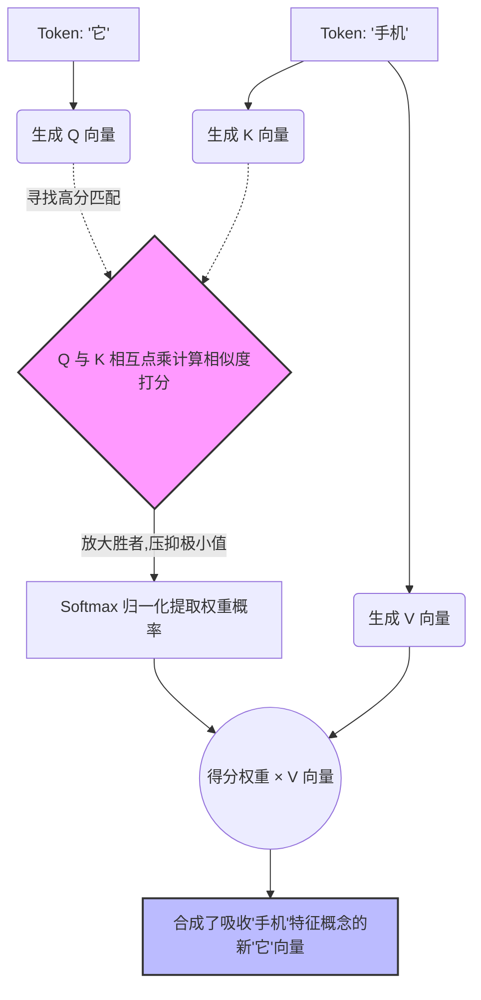

# 2. Transformer 与大模型核心推理流水线

在前一章中，我们将人类的复杂语言通过 Tokenization 转换成了冷冰冰的数字票据——**Token IDs**（例如一句话变成了序列 `[15496, 11, 995, 0]`）。
拿到这串离散的数字后，大模型（基于 Transformer 架构）到底是如何运转，并最终一字一句地把“思考结果”吐出来的呢？

以下是大模型在推理生成阶段，一次完整的**向前传播（Forward Pass）流水线**全景：

---

### 2.0 宏观流水线：从 Token ID 到下一 Token 的涌现机制

整个生成过程可以看作是一个“从一维数字，升维理解，再降维输出”的超级加工厂。每一个生成的字，都必定且只能经过这五个标准工序：

#### Step 1: 查字典升维 —— 词嵌入层 (Token Embedding)
*   **输入**：一维的离散整数序列，如 `15496`。
*   **操作**：模型底层保存了一张巨大的“查表字典”（Embedding Matrix）。在这个庞大的矩阵中，每一个专属的 Token ID 都静态绑定着一个高维数值向量（例如 4096 个维度组成的浮点数序列）。
*   **本质突破**：ID 只是一个毫无逻辑的序号，而 **Embedding 向量包含了词的本质“语义坐标”**。从这里开始，语义相近的“猫”和“狗”在几何空间里的夹角距离被拉近了。模型彻底告别了离散的序号，跃迁进入连续的线性代数宇宙。

#### Step 2: 注入时空感 —— 位置编码 (Positional Encoding)
*   **现状缺陷**：拿到 Embedding 后，Transformer 是一种天生的“全图并发视野”结构。它一次性并行审视所有的词，这导致它**分不清词的前后顺序**（对它来说，“你打我”和“我打你”的词向量集合是等价的）。
*   **解决操作**：在词嵌入向量的基础上，通过特殊算法叠加上一层**位置编码**（如现在主流的 RoPE 旋转位置编码）。
*   **结果**：每一个高维词向量不仅带着“我在语义上是什么意思”，还被打上了绝对且不可磨灭的“我在句子当中的时空坐标”。

#### Step 3: 核心加工厂 —— Transformer Blocks (多层叠加工序)
这是大模型真正的“大脑皮层”。一个模型通常包含几十层（如 Llama-3 有 32~80 层）结构一致、一环套一环的 Transformer 小车间 (Block)。在每一层车间里，数据主要经历两次核心洗礼：
1.  **注意力圆桌谈判 (Self-Attention Layer)**：让所有的 Token 进行一次高效交互。每个 Token 分配权限去吸纳上下文里与自己语义相关的其他 Token 信息（比如让代词 "it" 把注意力投向前面的实体 "apple"）。这是模型**“理解当下语境”**的关键途径。
2.  **前馈知识淬炼 (Feed Forward Network, FFN)**：吸收了上下文的联系后，每一个 Token 独立进入一个巨型全连接记忆库。学术界普遍认为，这一步是模型通过神经元激发，去抽取、激活它在千亿训练数据中背诵过的**“物理法则与世界知识”**的过程。
*(如此 30+ 层不断循环，像千层饼一样堆叠，模型提取到的逻辑和语义特征越发深刻高级。)*

#### Step 4: 降维与终极审判 —— 输出概率层 (Logits & Softmax)
*   **现状**：经过几十层的反复咀嚼，序列最后一个位置上的 Token 向量，此刻已经浓缩了所有的上下文意图，它准备好预测“我们要马上说出口的下一个字”了。
*   **操作**：
    1.  这个处于句末最高维的终极向量，被扔进最后一道**线性分类器（Linear Head/LM Head）**。
    2.  它的维度会被暴力降维，映射回**词表大小的宽度**（比如 15万维，对应前文提到的庞大 Token 词表）。
    3.  此时这15万个维度上的分数叫 **Logits（未经标准化的倾向得分）**。
    4.  通过套用 **Softmax 函数**，把这些生硬的分数转化成总和刚好为 100% 的**概率分布**。
*   **输出**：全词表每一个 Token 接在下一位的悬念概率（例："world" 概率排第一 85.3%，"guys" 排第二 11.2%）。

#### Step 5: 开盲盒 —— 采样与自回归转轮 (Autoregressive & Sampling)
*   **操作**：拿到全词表分布后，大模型绝大多数情况下**不一定**会只死板地选取第一名（否则说话就跟背板一样毫无波澜）。它会根据设定的 **Temperature (温度)**、Top-K/Top-p 规则，像摇俄罗斯轮盘一样，从高概率池子里**随机抽取一个 Token**。
*   **自回归闭环**：抽取出的这个新 Token，会立刻被当做已知确定的结果**拼接到上一段输入的尾部**。随后，整个序列被重新喂进模型，从 Step 1 再跑一遍。
*   **大模型的终极奥义**：**无论文章是一千字还是一万字，大模型内部的物理定律始终是：一次只预测下方的“一个 Token”。永不疲惫地重播，这就是所谓的“自回归模式”。**

---

在厘清了这条流水线主轴后，下面的章节我们将像拆卸精密引擎一样，深度拆解这条流水线上的“三大硬核核心工艺”。

### 2.1 纯 Decoder 架构：为什么 GPT 赢了？

早期的自然语言处理界，主流是 Google 提出的 **Encoder-Decoder（编码器-解码器）** 架构（如 T5 或早期的翻译模型）。这种架构就像是一个**“资深翻译官”**：
*   **Encoder** 先把所有的外语完整看一遍，提炼成一个中心思想向量。
*   **Decoder** 再根据这个中心思想，一句句翻译成母语。

但后来，OpenAI 的 GPT 系列证明了：**只要模型参数和训练数据足够大，“纯 Decoder（Decoder-only）”架构才是真正的王道。** 纯 Decoder 就像是一个**“即兴评书先生”**，它不看全稿，而是只根据已经讲出来的上半句，立刻顺着往下推演下半句。

#### 2.1.1 因果掩码 (Causal Masking)：防止模型“作弊”的神器
在预测下一个词时，模型在训练中绝对不能“偷看”到未来的词。为此，纯 Decoder 引入了**因果掩码（Causal Mask）**技术。
*   **浅显理解**：就像你在做一套英语完形填空，老师拿一张黑纸把你正在填的那个空隙及其后面所有的正确答案都遮住了，强迫你只能基于前文推理。
*   **底层图解**：在底层的 Attention 矩阵中，模型会强行生成一个对角线遮罩，把当前词**后面**的所有关联分数变成负无穷大。这样在经历 Softmax 概率化后，对未来的注意力权重就会变成绝对的 0。

#### 2.1.2 残差连接 (Residual Connection)
大模型动辄几十上百层深度，如果每一层都要对数据进行剥离重组式的猛烈计算，原始句子的初始信息很容易在传递到深层时变异或丢失（这就是所谓的梯度消失问题）。
*   **解决机制**：**残差连接**就像是在每个繁重加工车间旁边修了一条“免检高速旁路”。数据不仅要进车间加工，同时原始数据还会沿着旁路，直接加上加工后的结果送往下一层（运算过程是 `Output = F(x) + x`）。这样保证了无论网络堆叠多层，最基础的语义面貌始终不被抹杀。

---

### 2.2 自注意力机制 (Self-Attention) 深度剖析：Q、K、V 的哲学相亲局

Transformer 之所以能干掉 RNN 和 LSTM，核心全靠这句霸气的论文标题真理：“Attention Is All You Need”。

#### 2.2.1 搞懂 Q、K、V 的核心数学逻辑
你可以把自注意力机制理解为模型内部的一场**“大型词汇相亲局 / 数据库检索系统”**。每个词在进入注意力层时，都会被线性矩阵分裂成三个维度的分身：**Q (Query 查询特征), K (Key 引流招牌), V (Value 核心底蕴)**。

*   **Q (Query)**：代表“我此时此刻正在**寻求**什么上下文”。
*   **K (Key)**：代表“我本身**拥有**什么醒目特征”。
*   **V (Value)**：代表“如果有人注意到了我，我能给它**提供**的实际内容”。

> **【通俗推演案例】**
> 被处理的句子：“**苹果** 公司发布的新 **手机**，它的性能很强。”
> 当模型运行梳理“它”这个字眼时：
> 1.  “它”的 **Q** 发射雷达探测：*“我是个没意义的代词，前面谁是科技实物名词？快来与我产生关联！”*
> 2.  前面“苹果”和“手机”的 **K** 都在闪烁，但“苹果”的 K 显露出（公司属性），而“手机”的 K 显露出（设备属性）。
> 3.  “它”的 Q 分别与所有的 K 进行**点乘相乘（Dot Product）**打分。模型发现 Q 与“手机”的 K 匹配度最高。
> 4.  于是，“它”大量吸收了“手机”对应的 **V** 向量内容。在这一瞬间，“它”在多维空间里就不再是一个空洞的代词，而是被沾染涂满了“手机硬件”的概念属性。

#### 2.2.2 缩放点积：为什么要除以一个神秘的 $\sqrt{d_k}$？
Q 和 K 的点乘分数在维度非常高时，积累的数值有可能极其巨大。一旦分数过分悬殊，塞进后端的 Softmax 过滤器之后，最高的那个得分会被放大到几乎等于 1，其他的弱关连全被抹煞成了 0。这样模型就丧失了“同时温和地兼顾多个上下文”的弹性，且梯度计算会完全卡死。因此数学上必须除以维度规模的平方根 $\sqrt{d_k}$，来给这种狂暴的原始分数量级强行降温。

#### 2.2.3 多头注意力 (Multi-Head Attention)：多维度的神探天团
如果只有一个注意力机制视角，模型往往视野狭窄（比如只会死磕语法关系）。因此 Transformer 将高维空间切分出几百个独立的“平行关注组（Head）”。
*   **Head 1**：可能化身语法专家，专门寻找介词和动词的连桥关系。
*   **Head 2**：可能化身情感专家，专门搜捕整句话的褒贬递进。
*   **Head 3**：可能处理长距离的地理人名从属。
各个 Head 互不干扰，独自进行上面提到的 QKV 计算，最后模型把大家抓取到的结论平铺拼接到一起。多头机制是大模型显现出“逻辑全面严密”的物质基础。

---

### 2.3 位置编码 (Positional Encoding) 的空间魔法

既然是纯粹毫无顺序区分的并发计算方程，我们怎么让高维向量知道词语阅读的先后关系？业界主要经历了跨越性演进。

#### 2.3.1 早期：绝对位置编码（硬盖数学印章）
在第一代诸如 BERT 这样的模型中，位置编码就是强行给在第1个位置的词汇输入盖上一个“正弦函数戳 1”，给第2个位盖上“余弦函数戳 2”。
*   **致命缺陷**：这种设计很难处理超长文本。如果在训练期间它最远只看过了长达 4000 步的印章，当你强制它阅读 8000 字的小说时，它只要遇到从来没经受过训练的“戳 4001”数值范围，底层就会彻底抓瞎报错（丧失零样本的长度外推性）。

#### 2.3.2 现代标杆：旋转位置编码 (RoPE)
当前横扫统治所有开源届（Llama、Qwen 共尊）的方案就是 RoPE。它精妙至极！
*   **通俗比喻**：它把原本平直躺着的词语，统统放到了一个复数空间的**“多层圆规时钟表盘”**上。注入位置信息的动作，等价于把词汇的特征向量沿着这个表盘的圆周**旋转一个特定的角度弧度**（比如每一个字符差值偏转 15度）。
*   **神妙之处**：当过去词 A（在 12 点方向）和当下的词 B（在 3 点方向）进行注意力 QK 点乘时，触发的物理性质保证了模型只关心**两者之间的绝对偏转夹角（相差 90 度带来的余弦值损失）**，而根本不在乎它们具体是在几十万字小说里的哪两页触发的！
*   **核心优势**：RoPE 极其优雅地将**“相对距离”**概念天生雕刻进了纯粹并行的绝对注意力底层，为现在的十万甚至百万超长文本时代奠定了最坚实的基础。

---

### 2.4 归一化与激活函数：阻挡万亿计算崩溃的安全阀门

#### 2.4.1 Pre-Norm (前置归一化) 的终极求稳论述
*   **Post-Norm (后置清洗)**：在初代论文中，研究员喜欢在历经暴力的注意力组加工**之后**，再对打乱的数据进行清洗抑制（LayerNorm）防止溢出爆炸。但当后期大模型层数堆积到动辄几十甚至上百层时，方差的后置累计极易导致梯度的神经震荡，进而直接把好几周跑出来的参数练崩（Loss 函数飙升变成 NaN 值）。
*   **Pre-Norm (前置清洗)**：现在所有人学乖了。Llama 等几乎全部新模型都改用在进入核心加工间**发生反应之前**，先洗净和压制特征分量。这就像是在极易走火的炸药原料混合舱前先加设“泄压阀”。同时配合 **RMSNorm** 算法（省去了计算整体平均值的冗余步骤，只对均方根进行缩放，主打快速收敛），这套组合拳变态级地加强了大算力底池里的长时间运行稳定性。

#### 2.4.2 激活函数的分岔进化：通向含门控的 SwiGLU
在 FFNN（前馈网络层）加工站内部，模型需要极其复杂的“非线性激增开关”来拟合不讲道理的人类现实逻辑扭曲。
*   **刀耕火种**：以前最流行 ReLU——非常死板，接收到低于 0 的负贡献信号就一刀切拉闸。
*   **巅峰门控**：现在大家标配的是 **SwiGLU**。它的最大直观改进在于不仅自身足够平滑顺滑，并且引入了一条内部乘法运算机制的**智能交叉门控（Gating）**。
*   **隐喻**：这相当于 FFN 知识车库里不仅有提炼工，还配备了一位“动态质检主管”。主管拿到的不再是被动传输信号，他能通过比对两条平行通道，动态智能决定哪些概念应该被高亮放行输出，哪些无意义的历史噪音残渣可以就地隐掉屏蔽。这虽然增加了乘法参数量，但极大赋予了模型比纯净激活强出数倍的高复杂知识拟合能力。
