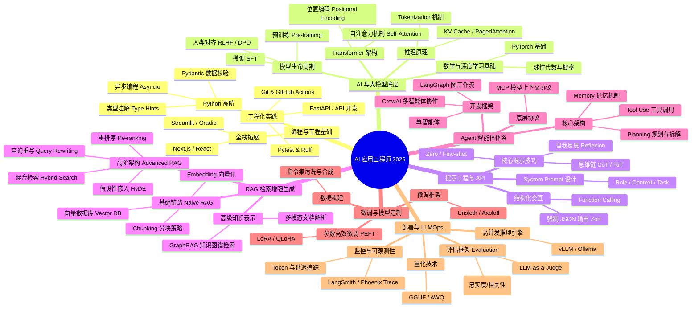

# 2026 AI 应用工程师体系脑图

你可以将以下 Mermaid 代码复制到支持 Markdown 的编辑器（如 Obsidian、Notion 或 GitHub）中查看树状脑图。

```mermaid
mindmap
  root((AI 应用工程师 2026))
    编程与工程基础
      Python 高阶
        异步编程 Asyncio
        类型注解 Type Hints
        Pydantic 数据校验
      工程化实践
        Git & GitHub Actions
        FastAPI / API 开发
        Pytest & Ruff
      全栈拓展
        Next.js / React
        Streamlit / Gradio
    AI 与大模型底层
      数学与深度学习基础
        线性代数与概率
        PyTorch 基础
      Transformer 架构
        自注意力机制 Self-Attention
        位置编码 Positional Encoding
      模型生命周期
        预训练 Pre-training
        微调 SFT
        人类对齐 RLHF / DPO
      推理原理
        Tokenization 机制
        KV Cache / PagedAttention
    提示工程与 API
      核心提示技巧
        Zero / Few-shot
        思维链 CoT / ToT
        自我反思 Reflexion
      System Prompt 设计
        Role / Context / Task
      结构化交互
        强制 JSON 输出 Zod
        Function Calling
    RAG 检索增强生成
      基础链路 Naive RAG
        Chunking 分块策略
        Embedding 向量化
        向量数据库 Vector DB
      高阶架构 Advanced RAG
        假设性嵌入 HyDE
        查询重写 Query Rewriting
        混合检索 Hybrid Search
        重排序 Re-ranking
      高级知识表示
        GraphRAG 知识图谱检索
        多模态文档解析
    Agent 智能体体系
      核心架构
        Memory 记忆机制
        Planning 规划与拆解
        Tool Use 工具调用
      底层协议
        MCP 模型上下文协议
      开发框架
        单智能体
        LangGraph 图工作流
        CrewAI 多智能体协作
    微调与模型定制
      参数高效微调 PEFT
        LoRA / QLoRA
      微调框架
        Unsloth / Axolotl
      数据构建
        指令集清洗与合成
    部署与 LLMOps
      量化技术
        GGUF / AWQ
      高并发推理引擎
        vLLM / Ollama
      评估框架 Evaluation
        Ragas (忠实度/相关性)
        LLM-as-a-Judge
      监控与可观测性
        LangSmith / Phoenix Trace
        Token 与延迟追踪
```
