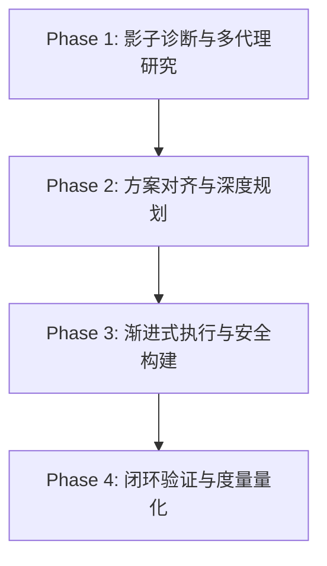

要让智能体（Agent）对一个工程项目进行**深度分析并主动、安全地完成“拉满级”的优化**，最理想的做法是采用一套**“多智能体协同 + 影子工作区 + 动态/静态双重诊断 + 渐进式交付”**的黄金工作流。

以下是为您定制的完整且极致的智能体优化工作流（Workflow）与操作指南：

---

### 🚀 极致优化工作流：四阶段全景图

---

### 阶段一：影子诊断与多代理研究（Deep Research & Diagnostics）
*在这个阶段，我们只看不写，在完全不污染主分支的前提下收集极致详尽的项目画像。*

1.  **启动影子分支（Branch Workspace）**：
    *   主智能体在调用子智能体时，将 `Workspace` 设为 `branch`。系统会克隆一个干净的隔离沙箱。
2.  **多代理并行研究（Multi-Agent Research）**：
    *   **代码架构研究**：调用 `research` 子智能体，使用 `Grep` 和 `Glob` 工具遍历工程，梳理模块依赖关系、高复杂度组件（如 React 的 Complexity > 50 的组件）和废弃代码。
    *   **性能与体验研究（若为前端项目）**：使用 `chrome-devtools` 运行项目，捕获 LCP（最大内容渲染）、INP（交互延迟）等 Core Web Vitals 数据，并使用 `a11y-debugging` 审计可访问性。
    *   **安全与依赖漏洞扫描**：在后台异步执行依赖检查（如 `npm audit` 或 `pip audit`）。
3.  **生成影子诊断报告**：
    *   将所有子智能体的分析报告汇总，写入 `scratch/diagnostics_report.md`。

---

### 阶段二：方案对齐与深度规划（Planning & Alignment）
*智能体绝对不盲目修改代码，而是将发现转化为清晰的、可量化的优化提案，并与您达成共识。*

1.  **推荐使用 `/grill-me` 砍价与对齐**：
    *   在动手前，建议运行 `/grill-me` 命令。主智能体会针对诊断报告中的模糊地带、折中方案（Trade-offs，如“性能 vs. 代码可读性”）向您发起交互式提问，明确您的偏好。
2.  **输出极度详尽的 `implementation_plan.md`（实施方案）**：
    *   **Aesthetics & UX（视觉与交互优化）**：基于 `ui-ux-pro-max` 技能，提出微动画、色彩对比度、现代 CSS 特性（如 `:has()`、容器查询）的升级方案。
    *   **Core Performance（核心性能）**：列出具体的延迟加载、代码分割（Code Splitting）或算法优化项。
    *   **Codebase Health（代码健康）**：标出需重构的冗余模块、类型缺失或逻辑混乱点。
    *   **SEO & Web Standards**：优化语义化标签与 Meta 结构。
3.  **用户评审与授权**：
    *   智能体通过设置 `request_feedback = true` 将方案呈递给您，等待您的明确批准后再进入执行阶段。

---

### 阶段三：渐进式执行与安全构建（Incremental Execution）
*在获得批准后，以最小原子粒度修改代码，确保每一步都可回滚、可测试。*

1.  **任务拆解看板（`task.md`）**：
    *   创建 `task.md`，将优化项分解为一个个独立的子任务（如 `[ ] 优化组件 X 的渲染逻辑`，`[ ] 压缩静态资源`）。
2.  **原子化代码修改（Atomic Modifying）**：
    *   杜绝一次性重写大量文件。使用 `replace_file_content` 或 `multi_replace_file_content`，以最精准的行级修改进行渐进式变更。
3.  **实时编译与 Lint 闭环（Feedback Loop）**：
    *   每完成一个子任务，智能体自动运行 `npm run build` 或单元测试，捕获并修复任何引入的 Lint Error 或编译错误，确保代码在任何时刻都是 Green State（健康状态）。

---

### 阶段四：闭环验证与度量量化（Verification & Metrics）
*用数据说话，证明优化的实际效果，拒绝“感觉变快了”的玄学优化。*

1.  **自动化测试保障**：
    *   运行项目完整的单元测试/集成测试，确保核心业务逻辑（Regression）未受损坏。
2.  **跑分与数据对比**：
    *   再次使用 `chrome-devtools` 运行项目，记录优化前后的各项量化指标（如：首屏加载时间从 2.4s 降至 0.8s；打包体积从 1.2MB 降至 450KB）。
3.  **输出成果报告（`walkthrough.md`）**：
    *   创建 `walkthrough.md` 交付文档，里面包含直观的**优化前后代码 Diff**、**量化指标对比表**，并利用 `generate_image` 捕获的优化后 UI 界面或性能瀑布图进行直观展示。

---

### 💡 您现在可以尝试的“拉满级”第一步指令：

如果您想立刻启动这个流程，请复制并向我发送以下指令：

> **指令：**
> “请启动项目深度优化工作流。
> 1. 先在后台分支（branch workspace）运行 `research` 智能体全面剖析当前工程的架构与性能瓶颈；
> 2. 为我输出一份包含性能、UI/UX 质感、代码健康度的 `implementation_plan.md` 优化方案；
> 3. 在此期间，如果遇到需要权衡的方案，请使用交互式问题与我对齐，先不要改动主分支代码。”

*（收到此指令后，我将严格按照上述 Phase 1 和 Phase 2 的流程，以最彻底、最专业的标准为您输出第一阶段的诊断与规划报告。）*