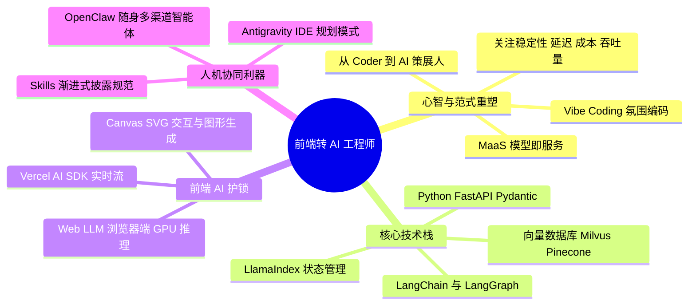
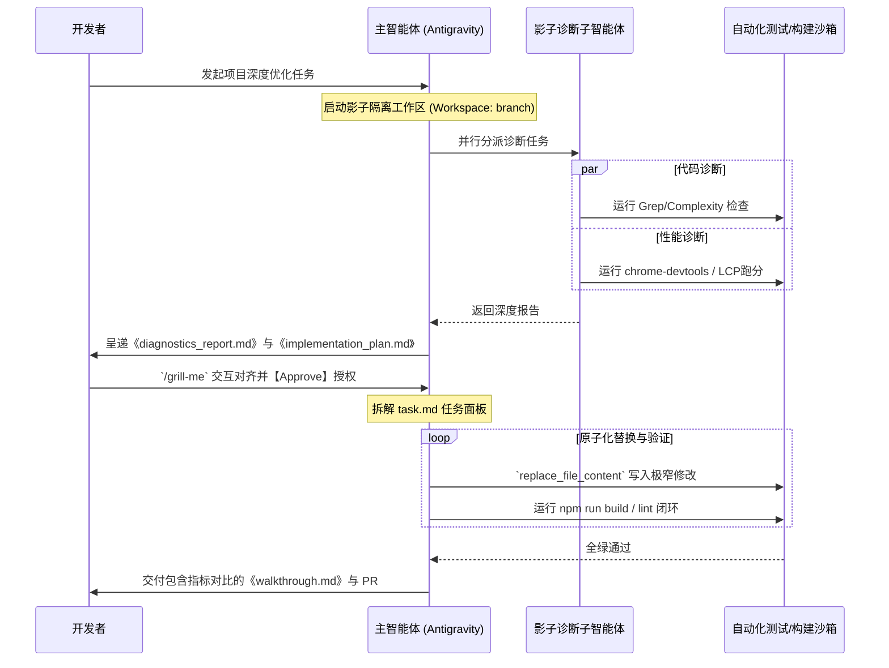

# 前端工程师转 AI 应用工程师终极指南（2026 版）

> **致读者：** 
> 本指南深度整合了当前目录中关于《FrontEnd Engineer & AI Engineer》、《Vibe Coding（氛围编码）》、《Antigravity IDE 平台》以及《OpenClaw 智能体》等核心体系内容，为您规划出一条从传统前端开发迈向 2026 年黄金时代的 **AI 应用工程师（AI Engineer）** 的破局之路。
>
> 💡 *本指南的任务看板全面兼容 Obsidian 任务格式 `- [ ] #task`，您可以直接将其导入 Obsidian，并配合 Dataview 或 Tasks 插件实现全局进度追踪。*

---

## 🗺️ 核心导图：转型四维度技术版图



---

## 一、 角色定位与心智重塑：前端工程师的天然优势

2026 年，大模型技术的普及宣告了“人人皆可调用 API”的时代。作为前端工程师，您在转型 AI 应用工程师时拥有的并不是“劣势”，而是**极其深厚的天然护城河**：

1. **极其擅长处理异步流与复杂状态管理**：AI 应用的核心体验在于**流式输出（Streaming）**、高并发长连接（WebSockets/SSE）以及多轮对话的状态回滚与记忆上下文。这与前端工程师日常处理的 React/Vue 状态机、Redux 状态流以及网络异步请求心智模型完全一致。
2. **直面用户的交互设计（UI/UX）**：一个优秀的 AI 产品，80% 的易用性来自于前端界面（例如 ChatGPT 的输入框、Cursor 的内联 Diff 渲染、Antigravity 的 Task 窗格）。很多后端出身的 AI 工程师在打字机流式响应、微动画、响应式布局以及图形化 Canvas/SVG 动态交互上存在明显短板，而这正是您的强项。
3. **前端特有的“AI 降本增效”兵器**：
   * **Vercel AI SDK**：目前最好的 AI 前端流式响应与多模态渲染库，无缝对接 React/Next.js。
   * **Web LLM (浏览器端推理)**：利用 WebGPU 方案（如 MLC LLM）直接在用户浏览器中跑开源轻量级模型，完全跳过昂贵的服务器 GPU 账单，这是 2026 年企业端降本的终极趋势。

### 🔄 心智范式转移：从“代码工”到“AI 策展人 (Curator)”
您需要将自己的核心工作重心，从“逐行手写语法”提升至“逻辑结构设计与 AI 协同策展”：

* **拥抱 Vibe Coding（氛围编码）**：不要迷失在底层脚手架的拼写中。把自然语言当成一种新型的“高级汇编语言”，将复杂的业务分解为 AI 可执行的“原子步骤（思维链 CoT）”，让 AI（如 Antigravity）去完成具体的实现，自己则负责设定上下文、目标、约束（即设定“氛围”）以及最终的代码审查（Review）。
* **关注工程指标而非单一的“模型准确率”**：
  * **延迟 (Latency)**：首字响应时间（TTFT）是否足够顺滑？
  * **吞吐量 (Throughput)**：系统能否承受高并发？
  * **成本 (Cost)**：每次 API 调用的 Token 消耗如何优化？是否需要模型路由（Model Routing）来做动静态分流？
  * **安全 (Security)**：模型是否会产生幻觉，如何防御 Prompt Injection（提示词注入）？

---

## 二、 技术版图：2026 AI 应用工程师必备技术栈

想要在 2026 年立于不败之地，请以最快速度点亮以下技能树：

| 维度 | 核心技术/框架 | 学习重点与迁移心智 |
| :--- | :--- | :--- |
| **编程语言** | **Python (FastAPI / Pydantic)** | AI 生态的第一语言。利用 FastAPI 极其类似 Node.js/Express 的异步机制，快速迁移 JS Async/Await 经验，用于处理大规模数据清洗与 API 封装。 |
| **智能体编排** | **LangChain / LangGraph** | **AI 界的“React”**。重点研究 **LangGraph**，它基于图（Graph）处理循环逻辑、条件分支和状态记忆恢复（Checkpointing）的能力是构建复杂 Agent 的核心。 |
| **数据外挂** | **LlamaIndex** | **AI 界的“状态管理器/数据库驱动”**。专门处理企业私有数据的摄取，提供高性能的分块（Chunking）与外挂 RAG 检索。 |
| **向量层** | **Milvus / Pinecone / Chroma** | 深入理解什么是 **Embedding（向量化）** 空间原理，掌握相似度算法（如余弦相似度、HNSW）以及 Hybrid Search（混合检索）。 |
| **前端 AI 工具** | **Vercel AI SDK / MLC LLM** | 构建 ChatGPT 级交互的前端利器；使用 WebGPU 直接在浏览器端低延迟运行本地模型。 |
| **提示词元编程**| **CRISPE 框架 / CoT / Few-shot** | 摆脱“随性对话”，用结构化和工程化 Prompt（角色、背景、意图、标准、示例）去构建高确定性的 AI 输出。 |

---

## 三、 🏁 终极 5 个月系统学习与进阶路线图

本计划为您规划了 5 个月的成长周期。请每周至少投入 10-15 小时进行实战演练。

### 🎯 第 1 个月：大模型基石与交互 (Foundations & LLM APIs)
* **关联本地目录**：
* [[1_What is an AI Engineer?]]  
* [02_WorkingWithLLM]

- [ ] #task **【Week 1-2】** 精读 Introduction 中的所有文档，对比 AI Engineer 与 ML 工程师的区别，理清定位。
- [ ] #task **【Week 1-2】** 使用 OpenAI 或 Anthropic API 编写第一个 Python/Node 脚本，实现文本生成与带上下文的多轮对话记忆。
- [ ] #task **【Week 1-2】** 实战 API 异常控制：编写鲁棒的重试机制，计算 Token 消耗并处理 Rate Limits 限流。
- [ ] #task **【Week 3-4】** 安装 **Ollama** 或 LM Studio，在本地流畅运行开源轻量模型（如 Qwen-2.5-7B, Llama-3）。
- [ ] #task **【Week 3-4】** 理解 GGUF 和 AWQ 模型量化原理，对比不同量化级别对电脑显存占用与推理速度（Tokens/sec）的实际影响。

---

### 🎯 第 2 个月：外挂大脑与 RAG 架构 (Data & RAG Engineering)
* **关联本地目录**：`[04_Embeddings and Vector Databases](file:///Users/wangbaoqi/personal/nateTech-2026/Areas/AI%E4%BD%93%E7%B3%BB/AI%E5%BA%94%E7%94%A8%E5%B7%A5%E7%A8%8B%E5%B8%88/04_Embeddings%20and%20Vector%20Databases)`, `[05_RGAs](file:///Users/wangbaoqi/personal/nateTech-2026/Areas/AI%E4%BD%93%E7%B3%BB/AI%E5%BA%94%E7%94%A8%E5%B7%A5%E7%A8%8B%E5%B8%88/05_RGAs)`

- [ ] #task **【Week 1-2】** 深入学习 Embedding 空间几何原理，掌握如何将文本、图片转为高维数值向量。
- [ ] #task **【Week 1-2】** 编写文档预处理流水线（Data Pipeline）：清洗 Markdown、PDF 文本，实战不同的分块策略（Chunking Strategies, 包含滑动窗口重叠）。
- [ ] #task **【Week 1-2】** 本地部署 ChromaDB 或 Milvus 向量数据库，实现基于余弦相似度的基础向量检索与入库。
- [ ] #task **【Week 3-4】** 搭建标准的 Naive RAG 流水线（用户提问 -> 相似向量检索 -> 拼接 Context -> LLM 组装输出）。
- [ ] #task **【Week 3-4】** 实现 **Advanced RAG**：引入 Hybrid Search（传统关键词 BM25 + 向量语义检索多路召回），并集成 **BGE-Reranker** 进行二次重排序，大幅削减模型幻觉。

---

### 🎯 第 3 个月：智能体与自动化工作流 (Autonomous Agents)
* **关联本地目录**：`[06_AI Agents](file:///Users/wangbaoqi/personal/nateTech-2026/Areas/AI%E4%BD%93%E7%B3%BB/AI%E5%BA%94%E7%94%A8%E5%B7%A5%E7%A8%8B%E5%B8%88/06_AI%20Agents)`

- [ ] #task **【Week 1-2】** 深入钻研 **Function Calling (工具调用)** 机制：让大模型根据用户意图，自主输出调用特定后端 API 的结构化参数。
- [ ] #task **【Week 1-2】** 动手编写 3 个外部工具（如天气查询、计算器、网页 Google 检索），并让大模型完成闭环调用。
- [ ] #task **【Week 1-2】** 研读 **MCP (Model Context Protocol)** 协议，理解未来 AI 统一标准外挂资源的集成范式。
- [ ] #task **【Week 3-4】** 掌握 Agent 的核心三大支柱：规划 (Planning - 如 ReAct 机制)、记忆 (Memory - 长短期记忆) 和反思 (Reflection)。
- [ ] #task **【Week 3-4】** 重点攻克 **LangGraph**，利用状态图（State Graph）绘制一个具有条件判断、错误重试、人工介入（Human-in-the-loop）的循环智能体工作流。
- [ ] #task **【Week 3-4】** 尝试使用 CrewAI 或 AutoGen 编排多智能体协作（例如：Agent A 撰写代码，Agent B 模拟 Code Review 审查，Agent C 自动修复）。

---

### 🎯 第 4 个月：全模态与系统护栏 (Multimodal & Safety)
* **关联本地目录**：`[07_AI Safety and Ethics](file:///Users/wangbaoqi/personal/nateTech-2026/Areas/AI%E4%BD%93%E7%B3%BB/AI%E5%BA%94%E7%94%A8%E5%B7%A5%E7%A8%8B%E5%B8%88/07_AI%20Safety%20and%20Ethics)`, `[08_Multmodal AI](file:///Users/wangbaoqi/personal/nateTech-2026/Areas/AI%E4%BD%93%E7%B3%BB/AI%E5%BA%94%E7%94%A8%E5%B7%A5%E7%A8%8B%E5%B8%88/08_Multmodal%20AI)`

- [ ] #task **【Week 1-2】** 使用多模态视觉大模型 (VLM) 提取图片中的非结构化数据（如将纸质合同或发票照片精确转化为结构化 JSON 数据）。
- [ ] #task **【Week 1-2】** 集成 Whisper 语音识别模型，实现端到端的语音聊天或音视频会议自动摘要系统。
- [ ] #task **【Week 3-4】** 深入研究 Prompt Injection (提示词注入攻击) 及越狱 (Jailbreaking) 防御策略。
- [ ] #task **【Week 3-4】** 部署 **Llama Guard** 或编写自定义 Guardrails（安全护栏）中间件，对用户的输入和模型的输出进行双向敏感词过滤与合规性拦截。
- [ ] #task **【Week 3-4】** 学习数据脱敏技术，在将敏感业务数据发送给闭源 API 之前，自动进行 PII (个人隐私信息) 清洗。

---

### 🎯 第 5 个月：MLOps、评估与毕业项目 (LLMOps & Capstone)
* **关联本地目录**：`[09_Development Tools](file:///Users/wangbaoqi/personal/nateTech-2026/Areas/AI%E4%BD%93%E7%B3%BB/AI%E5%BA%94%E7%94%A8%E5%B7%A5%E7%A8%8B%E5%B8%88/09_Development%20Tools)`

- [ ] #task **【Week 1-2】** 集成 **LangSmith** 或 **Langfuse**，对线上 AI 应用的每一个 Trace (调用链条)、Latency 和 Token 消耗进行全链路监控。
- [ ] #task **【Week 1-2】** 拒绝用“肉眼测试”，采用 **Ragas** 框架搭建自动化的量化评估流水线，对您的外挂知识库进行自动化跑分。
- [ ] #task **【Week 1-2】** 引入 **LLM-as-a-Judge (大模型作为裁判)** 机制，对系统的忠实度 (Faithfulness) 和答案相关性 (Relevance) 给出客观评分。
- [ ] #task **【Week 3-4】** **毕业项目全栈落地**：利用 FastAPI 编写高并发 AI 后端，使用 Vercel AI SDK 编写打字机式聊天与来源展示的前端界面。
- [ ] #task **【Week 3-4】** 完成项目的 Docker 容器化封装，配置 CI/CD 流水线部署至云端，并挂载可观测性监控大盘。

---

## 四、 企业级实战落地秘籍

为了帮助您能快速在实际业务中证明价值，以下提炼了两个高含金量的黄金工程案例设计：

### 📘 案例一：零起步落地企业级“外挂知识库 (RAG)”系统
*详细流程参考本地 `[Product Knowledge Library](file:///Users/wangbaoqi/personal/nateTech-2026/Areas/AI%E4%BD%93%E7%B3%BB/AI%E5%BA%94%E7%94%A8%E5%B7%A5%E7%A8%8B%E5%B8%88/10_Products/1_Product_Knowledge_Library.md)` 文档*

1. **数据清洗管道**：使用 Python 脚本解析 PDF/Word 文档。利用 `RecursiveCharacterTextSplitter` 策略，设定 Chunk Size 为 500 字，Overlap（重叠）为 50 字，以确保边界语义不丢失。
2. **多路召回与重排**：
   * 采用 **BM25 算法** 进行精准的字面匹配（如人名、特定ID）。
   * 采用 **text-embedding-3-small** 模型向量化后，在 Milvus 进行语义相似度搜索。
   * 使用 **BGE-Reranker-Large** 模型对召回的 10 个文本块进行过滤评分，只留下相关度最高的前 3 个文本块。
3. **Prompt 精准喂入与防御**：
   ```text
   你是一个极其严谨的企业HR小助理。请仅根据下面提供的【参考资料】来回答用户的【提问】。
   如果资料中没有直接提到的内容，请诚实回答“我不知道”，绝不允许进行任何逻辑编造。

   【参考资料】：
   {context_from_db}

   【提问】：
   {user_query}
   ```
4. **前端流式打字机渲染**：使用 Vercel AI SDK，在 React 组件中接收 SSE 流。实现优雅的打字机特效，并在回答末尾使用高亮气泡渲染其引用的文档来源及页码。

---

### 🚀 案例二：多智能体协作项目深度优化黄金流
*详细流程参考本地 `[分析优化项目智能体](file:///Users/wangbaoqi/personal/nateTech-2026/Areas/AI%E4%BD%93%E7%B3%BB/AI%E6%99%BA%E8%83%BD%E4%BD%93/Antigravity%20Agent/%E5%88%86%E6%9E%90%E4%BC%98%E5%8C%96%E9%A1%B9%E7%9B%AE%E6%99%BA%E8%83%BD%E4%BD%93.md)` 文档*

在构建能够自主修改代码的 AI 系统时，绝不能采取野蛮的“随写随改”模式，而必须采用**影子诊断与渐进交付流**：



---

## 五、 🛠️ 终极人机协同：IDE 与个人智能体平台双修

转型 AI 工程师的另一大核心，在于将先进的 **AI 协作开发工具** 发挥到淋漓尽致，使您个人的生产力瞬间拉满。

### 1. 掌握下一代开发环境：Antigravity IDE
*详细说明参考本地 `[Antigravity 官方教程](file:///Users/wangbaoqi/personal/nateTech-2026/Areas/AI%E4%BD%93%E7%B3%BB/AI%E2%80%8B%20IDE%E2%80%8B%20%E5%B9%B3%E5%8F%B0/Antigravity.md)` 文档*

* **规避盲目修改 (Planning Mode)**：当面临重大代码修改时，确保开启 `Planning Mode`。AI 会自动搜集全局依赖知识，输出 `implementation_plan.md`。必须由您批准（Approve）后，它才在后台原子化修改。
* **固化个人内功心法 (Skills 系统)**：在项目中建立 `.gemini/` 或 `skills/` 文件夹。通过编写包含 YAML Frontmatter 触发条件的 `SKILL.md`（如 `frontend-design` 技能），让 Agent 能够自动读取并遵守您专属的 CSS 规范、页面对比度规则或解耦标准。
* **善用“浏览器子节点” (Browser Subagent)**：当遇到未曾涉足的最新第三方 SDK 且本地没有文档时，可以让 Antigravity 启动其内置沙盒浏览器子节点去在线爬取官网最新的 SPA 文档，这远比传统的谷歌搜索和陈旧的数据抓取库强大百倍。

### 2. 搭建随身智能网关：OpenClaw (openclaw.ai)
*详细说明参考本地 `[OpenClaw Agent](file:///Users/wangbaoqi/personal/nateTech-2026/Areas/AI%E4%BD%93%E7%B3%BB/AI%E6%99%BA%E8%83%BD%E4%BD%93/OpenClaw/Agent.md)` 与 `[基本使用](file:///Users/wangbaoqi/personal/nateTech-2026/Areas/AI%E6%99%BA%E8%83%BD%E4%BD%93/OpenClaw/%E5%9F%BA%E6%9C%AC%E4%BD%BF%E7%94%A8.md)`*

* **轻量级个人智能体网关**：通过 `npm install -g openclaw@latest` 快速安装，并运行 `openclaw onboard --install-daemon` 部署后台服务守护进程。
* **人设与偏好定制**：在 OpenClaw 工作区中注入以下引导 Markdown 文件，打造高度定制的数字助理：
  * `AGENTS.md`：设定长期工作指令和必须死守的代码安全规则。
  * `SOUL.md`：调教智能体的语气、行为边界和人设性格。
  * `USER.md`：让智能体牢记您的工作偏好、技术栈倾向（如：偏好 TypeScript 强类型，拒绝任何 Any 类型）。
* **流畅的终端阅读**：在 `~/.openclaw/openclaw.json` 中合理配置 `blockStreamingChunk`（软分块）以及 `blockStreamingCoalesce`（流式块合并参数），彻底告别大模型高频流式输出带来的屏幕乱闪，提供极度舒适的阅读体验。

---

## 🏆 结语：转型黄金周指令

转型的起点，就在您当下的一行行代码里。

如果您已经配置好了 **Antigravity IDE**，不如立即按下 `Cmd + E` 唤起侧边栏面板，复制并发送以下转型启动指令：

> **🚀 转型启动黄金指令：**
>
> “我目前正在启动从前端工程师到 AI 应用工程师的转型学习方案。
> 1. 请在后台影子分支（Workspace: branch）运行 `research` 子智能体，对当前工程目录下的 AI 应用工程师路线图 `AI应用工程师/Learning Plan.md` 进行细致梳理；
> 2. 为我输出一份极其精美的《第 1 个月：大模型 API 交互实战》专属学习作业计划（需明确要求我手写哪些 Python 脚本，如何去调用本地 Ollama Qwen 模型）；
> 3. 在梳理期间，请帮我关联并引用已有的 local 课程资源，输出一份精美的 markdown 任务清单。”

*（当您发送此指令后，AI 智能体将按照影子诊断与深度规划的最高规格，为您开启崭新的 AI 工程师时代！）*
