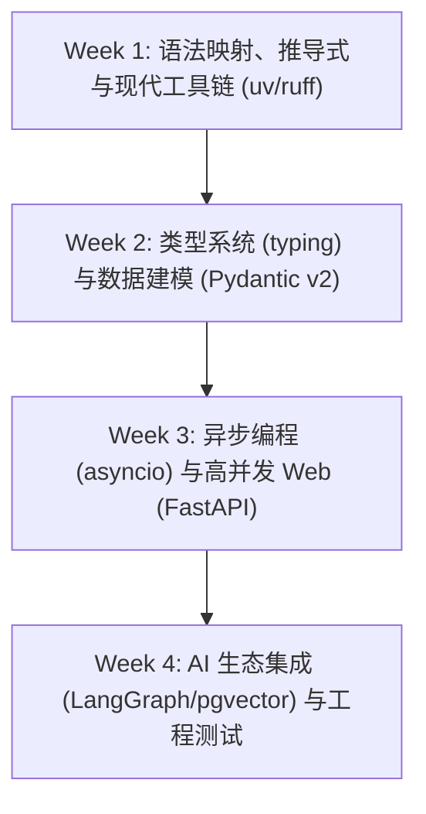

# 面向前端/TS 开发者的 Python 极速攻坚与 AI 落地指南

> **核心策略**：对于精通 TypeScript/JavaScript 的前端工程师而言，完全没必要从“什么是变量、什么是 `if/else`”学起。
> 本指南采用 **思维模型映射（TypeScript ➔ Python）** 的方式，帮助你在 **4 周** 内快速掌握 Python 核心语法、类型系统、异步编程（`asyncio`）、数据建模（`Pydantic v2`）以及 AI Web 后端（`FastAPI`）全套技能。

---

## 快速对照：TypeScript vs Python 语法映射表

| 概念/功能 | TypeScript / JavaScript | Python 3.12+ 对应实现 | 核心差异与注意点 |
| :--- | :--- | :--- | :--- |
| **数组/切片** | `arr.slice(1, 3)` | `arr[1:3]` | Python 支持负数索引 `arr[-1]`（倒数第一个） |
| **数组遍历映射** | `arr.map(x => x * 2)` | `[x * 2 for x in arr]` | Python 推荐使用 **列表推导式 (List Comprehension)** |
| **条件过滤** | `arr.filter(x => x > 0)` | `[x for x in arr if x > 0]` | 简洁直观，性能优于 `filter()` 函数 |
| **对象/字典** | `const obj = { a: 1 }` | `obj = {"a": 1}` 或 `dict(a=1)` | Python `dict` 的 key 必须加引号；获取属性用 `obj["a"]` 或 `obj.get("a")` |
| **匿名函数** | `(x, y) => x + y` | `lambda x, y: x + y` | Python `lambda` 只能包含单行表达式 |
| **解构赋值** | `const [a, ...rest] = arr` | `a, *rest = arr` | Python 解构语法非常灵活（如 `a, b = b, a` 交换变量） |
| **类与构造函数**| `class A { constructor(x) { this.x = x } }` | `class A: def __init__(self, x): self.x = x` | Python 类方法首个参数必须显式写 `self` |
| **异步并发** | `await Promise.all([p1, p2])` | `await asyncio.gather(p1, p2)` | Python 需要显式引入 `import asyncio` |
| **错误处理** | `try { ... } catch (e) { ... }` | `try: ... except Exception as e: ...` | Python 支持 `else`（无异常执行）和 `finally` |
| **类型定义** | `type User = { name: string, age?: number }` | `class User(BaseModel): name: str; age: int \| None = None` | Python 运行时校验首选 **Pydantic v2** |

---

## 4 周 Python 攻坚计划表

---

### 第 1 周：语法映射、核心特性与现代工具链 (uv / ruff)

#### 🎯 学习目标
跳过基础语法，聚焦 Python 特有高效语法（推导式、装饰器、上下文管理器），并配置现代 Python 环境。

#### 1.1 核心知识点
- **现代工具链配置（告别复杂的 `pip` / `conda`）**：
  - 使用 `uv`（Astral 出品，基于 Rust，比 pip 快 10-100 倍）：`uv venv` 创建虚拟环境、`uv add` 安装依赖、`uv run main.py` 运行。
  - 使用 `ruff` 进行代码 Linting & Formatting（代替 flake8/black）。
- **Python 高级语法特性**：
  - 列表/字典/集合推导式（List/Dict/Set Comprehension）与生成器表达式 `(x for x in range(1000))`。
  - **装饰器 (Decorators)** 深入理解：高阶函数包装、`@functools.wraps` 保持元数据、带参数的装饰器 `@decorator(arg)`。
  - **上下文管理器 (Context Manager)**：`with open(...) as f:` 语法、`__enter__` 和 `__exit__` 机制、`contextlib.contextmanager` 装饰器。
  - **魔术方法 (Dunder Methods)**：`__str__`, `__repr__`, `__call__`, `__getitem__`。

#### 1.2 权威学习资源
- 📖 [uv 官方快速入门](https://docs.astral.sh/uv/)
- 📖 [Python 3 官方教程 - Data Structures](https://docs.python.org/3/tutorial/datastructures.html)
- 🎥 YouTube / B 站 search: *Python Decorators Explained for JavaScript Developers*

#### 1.3 阶段练习题目
- **练习 1.1（推导式与字典处理）**：编写函数 `clean_query_params(params: dict) -> dict`，使用字典推导式自动过滤掉所有值为 `None` 或空字符串 `""` 的键值对，并将所有 key 转化为小写。
- **练习 1.2（手写装饰器）**：手写一个 `@retry(max_retries=3, delay=1.0)` 装饰器，当被修饰的同步/异步函数抛出异常时，打印重试日志并在延迟 `delay` 秒后自动重试，达到最大重试次数后抛出最终异常。

---

### 第 2 周：类型系统 (typing) 与数据建模 (Pydantic v2)

#### 🎯 学习目标
熟练掌握 Python 类型标注（Type Hints），并精通大模型 Structured Output 必备利器 —— **Pydantic v2**。

#### 2.1 核心知识点
- **Python Type Hints（TypeScript 视角）**：
  - 基础类型与泛型：`list[str]`, `dict[str, Any]`, `tuple[int, ...]`, `Set[str]`。
  - 联合与可选：`str | int` (等价于 `Union[str, int]`)、`str | None` (等价于 `Optional[str]`)。
  - 高级类型：`Callable[[int, str], bool]`, `Literal["gpt-4o", "claude-3-5-sonnet"]`, `Annotated[str, Field(...)]`。
  - 静态类型检查器 `mypy` 或 `pyright` 配置。
- **Pydantic v2（Python 界的 Zod）**：
  - `BaseModel` 定义模型与字段默认值。
  - `Field(description="...", ge=0, le=1)` 设定字段元数据（直接用于 LLM Function Calling 的 Prompt 生成）。
  - `@field_validator` 与 `@model_validator` 自定义校验逻辑。
  - 序列化与反序列化：`model_dump()`, `model_dump_json()`, `model_validate_json()`。
  - **OpenAI Structured Outputs** 原理：利用 `PydanticModel.model_json_schema()` 导出 JSON Schema 传给大模型。

#### 2.2 权威学习资源
- 📖 [Pydantic v2 官方文档与 Interactive Guide](https://docs.pydantic.dev/latest/)
- 📖 [Python typing 官方文档](https://docs.python.org/3/library/typing.html)

#### 2.3 阶段练习题目
- **练习 2.1（Pydantic 校验器）**：定义 `AgentToolCall` Pydantic 模型，包含 `tool_name: str`、`args: dict[str, Any]`、`timeout: int`（默认 5，范围 1~60 秒）。添加 `@field_validator("tool_name")` 校验工具名只能是小写字母和下划线。
- **练习 2.2（LLM JSON Schema 转换）**：定义一个表示“用户前端简历分析”的复杂 Pydantic 模型（包含基本信息、技能列表、工作经历数组），导出其 `model_json_schema()` 并打印，观察格式与 OpenAI Function Call `parameters` 的对应关系。

---

### 第 3 周：异步编程 (asyncio) 与高并发 Web 框架 (FastAPI)

#### 🎯 学习目标
理解 Python Event Loop 与 Node.js 的异同，掌握 `asyncio` 并发控制与 FastAPI 高性能 AI 接口搭建。

#### 3.1 核心知识点
- **Python `asyncio` 深入理解**：
  - 事件循环 (Event Loop)、Task 协程对象、`async def` 与 `await`。
  - 常用并发控制：
    - `await asyncio.gather(*tasks)`（相当于 `Promise.all`）
    - `asyncio.create_task(coro)`（后台异步任务）
    - `asyncio.Semaphore(value)`（信号量，控制大模型 API 并发数防止限流）
  - 生成器与异步生成器：`yield` 与 `async for item in async_generator()`（用于流式 Token 处理）。
- **FastAPI 框架全解**：
  - 路由声明与请求体/查询参数自动解析（绑定 Pydantic）。
  - 依赖注入系统 (`Depends`)：实现 API Key 校验、数据库连接池复用。
  - **`httpx.AsyncClient`**：Python 异步 HTTP 客户端（相当于 Node.js 中的 `axios` / `fetch`）。
  - **流式响应 (`StreamingResponse`)**：配合 `async generator` 实现打字机效果的 SSE 接口。

#### 3.2 权威学习资源
- 📖 [FastAPI 官方教程 (必读)](https://fastapi.tiangolo.com/tutorial/)
- 📖 [Python asyncio 深入指南](https://realpython.com/async-io-python/)
- 📖 [HTTPX Async Basics](https://www.python-httpx.org/async/)

#### 3.3 阶段练习题目
- **练习 3.1（`asyncio.Semaphore` 并发限速）**：编写 Python 脚本，模拟向 OpenAI 发送 20 个并发请求。使用 `asyncio.Semaphore(3)` 限制同时最多只能有 3 个请求在执行，打印请求开始与结束的时间戳验证限流效果。
- **练习 3.2（FastAPI SSE 智能流式接口）**：编写 FastAPI 应用，暴露 POST `/v1/chat/completions`。接收前端 Prompt，使用 `httpx.AsyncClient` 异步流式请求 DeepSeek API，并使用 `StreamingResponse` 将接收到的 Token 即时转发吐给前端。

---

### 第 4 周：AI 生态集成与工程实践 (LangGraph / pgvector / Testing)

#### 🎯 学习目标
将 Python 能力运用于主流 AI 框架（LangGraph、pgvector、LlamaIndex），并掌握自动化测试与工程打包。

#### 4.1 核心知识点
- **Python AI SDK 与框架集成**：
  - `openai` / `anthropic` Python SDK 官方调优（使用 `AsyncOpenAI` 异步客户端）。
  - `langgraph` 状态图编排：`StateGraph`、`TypedDict` 状态定义、`Annotated[list, add_messages]` 消息追加。
  - `pgvector-python` / `qdrant-client` 向量插入与查询。
- **Python 工程化与测试**：
  - **`pytest` & `pytest-asyncio`**：编写 Python 单元测试与异步 API 测试（使用 `TestClient` / `AsyncClient`）。
  - 项目目录规范（Standard Source Layout `src/my_package` 与 `pyproject.toml` 配置）。
  - Docker 部署 Python 应用（使用多阶段构建与 `uv export` 优化镜像体积）。

#### 4.2 权威学习资源
- 📖 [LangGraph Python Tutorial](https://langchain-ai.github.io/langgraph/)
- 📖 [pytest 官方文档与 pytest-asyncio](https://docs.pytest.org/)
- 🛠️ [pgvector-python GitHub Repo](https://github.com/pgvector/pgvector-python)

#### 4.3 阶段练习题目
- **练习 4.1（pytest 异步测试）**：为第 3 周编写的 FastAPI SSE 接口编写一个 `pytest` 测试用例，使用 `httpx.AsyncClient` 发起请求，断言 HTTP 状态码为 200 且返回头的 `content-type` 为 `text/event-stream`。
- **练习 4.2（LangGraph Agent 状态图构建）**：使用 `langgraph` 编写一个包含“思考节点”和“计算器工具节点”的简易 Agent，在 Python 中运行并断言其状态转移结果符合预期。

---

## 💡 前端学 Python 的 3 个“避坑”锦囊

1. **绝对不要用 `pip` 手动安装包**：统一使用 `uv add package_name`，让 `uv` 自动处理虚拟环境与依赖锁定（`uv.lock`），避免污染全局 Python 环境。
2. **警惕 `self` 与作用域问题**：Python 类方法中必须明确写出首参数 `self`（相当于 JS 的 `this`），在类内部调用其他方法必须写 `self.my_method()`。
3. **保持“双引擎”思维**：把 Python 当作你的 **AI 引擎与后端计算工具**，把 TS/React 当作你的 **UI/UX 与前端交付工具**。两者的协同结合，能为你建立极其稳固的复合竞争力！
