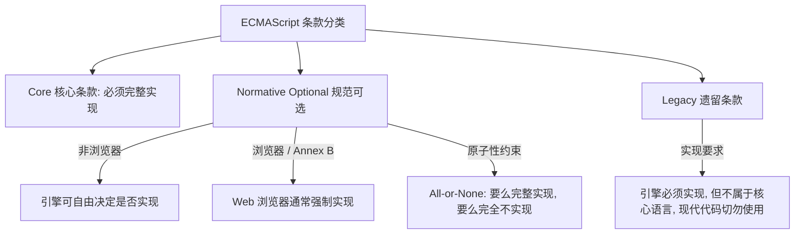
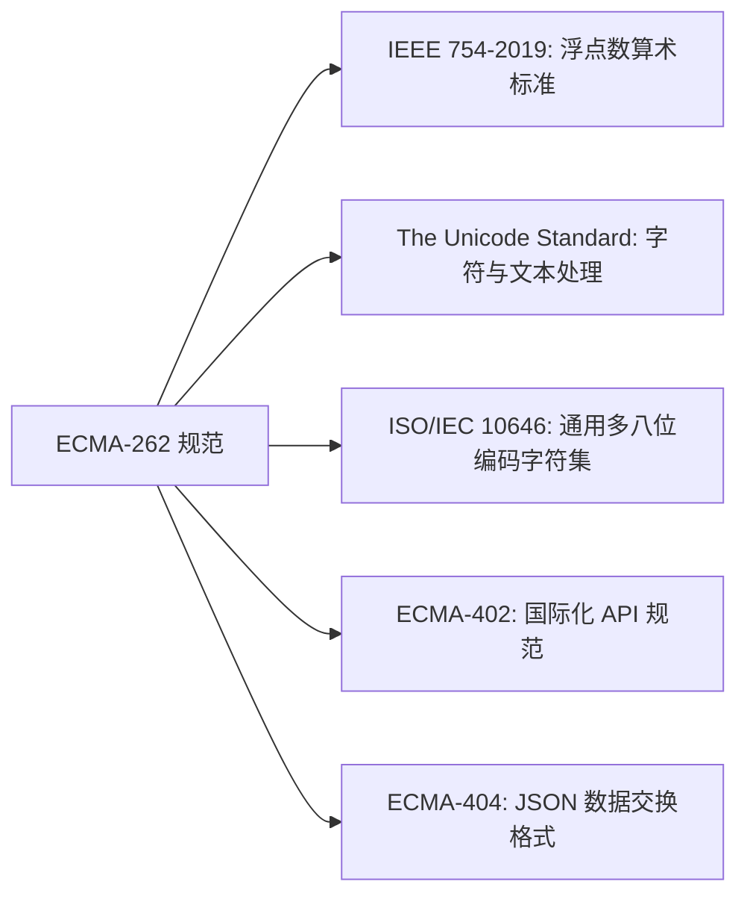
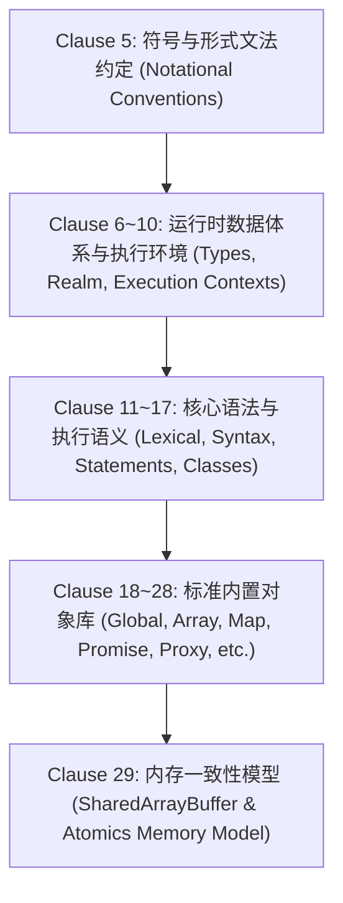

# ECMAScript 规范导读与核心架构全景 (ECMA-262 Clause 1 ~ 4)

---

## 目录
- [一、 语言定位与历史演进（Introduction & Scope）](#一-语言定位与历史演进introduction--scope)
  - [1. 语言起源与现状](#1-语言起源与现状)
  - [2. 关键版本历史与演进历程](#2-关键版本历史与演进历程)
  - [3. 现代年度演进特性矩阵 (ES2016 ~ ES2026)](#3-现代年度演进特性矩阵-es2016--es2026)
- [二、 规范符合性与边界约束（Clause 2 Conformance）](#二-规范符合性与边界约束clause-2-conformance)
  - [1. 核心强制实现要求](#1-核心强制实现要求)
  - [2. 引擎扩展自由度与红线约束](#2-引擎扩展自由度与红线约束)
  - [3. 条款分类与约束机制（Normative Optional & Legacy）](#3-条款分类与约束机制normative-optional--legacy)
- [三、 规范性引用文件体系（Clause 3 Normative References）](#三-规范性引用文件体系clause-3-normative-references)
  - [1. 引用适用原则](#1-引用适用原则)
  - [2. 五大底层标准依赖与作用](#2-五大底层标准依赖与作用)
- [四、 语言概念与运行哲学概览（Clause 4 Overview）](#四-语言概念与运行哲学概览clause-4-overview)
  - [1. 宿主环境与非自足性（4.1 ~ 4.2）](#1-宿主环境与非自足性41--42)
  - [2. 基于原型的对象体系与严格模式（4.3）](#2-基于原型的对象体系与严格模式43)
  - [3. 核心术语与定义精要（4.4 Terms and Definitions）](#3-核心术语与定义精要44-terms-and-definitions)
  - [4. ECMA-262 规范的整体结构（4.5 Organization）](#4-ecma-262-规范的整体结构45-organization)

---

## 一、 语言定位与历史演进（Introduction & Scope）

### 1. 语言起源与现状
- **标准定义**：ECMA-262 规范定义了 **ECMAScript 通用编程语言**（最新第 18 版对应 ECMAScript 2027）。
- **起源**：基于 Netscape 的 **JavaScript**（由 Brendan Eich 发明）与微软的 **JScript** 发展而来。
- **定位演进**：从早期仅作为浏览器客户端的脚本语言，演进为涵盖浏览器、服务端（Node.js / Deno / Bun）、嵌入式设备及桌面端的全球主流通用多范式编程语言。

### 2. 关键版本历史与演进历程
1. **ES1 (1997) ~ ES3 (1999) 奠基期**：
   - ES1 确立标准化基础；ES2 对齐 ISO/IEC 16262；
   - ES3 引入正则表达式、字符串高级处理、`try/catch` 异常处理、格式化输出等，奠定现代 JS 雏形。
2. **ES4 (流产) 与 ES5 / ES5.1 (2009 / 2011) 规范化期**：
   - ES4 因设计激进产生分歧未发布，部分成果转入 ES6；
   - ES5 规范化浏览器实现，引入**严格模式（Strict Mode）**、**访问器属性（Getter/Setter）**、对象反射与元属性控制、数组增强及原生 **JSON**。
3. **ES6 / ES2015 现代化里程碑**：
   - 历时 15 年的集大成之作，专为大型应用开发设计；
   - 引入 ES 模块化（Module）、类（Class）、块级作用域（`let`/`const`）、迭代器与生成器（Iterators/Generators）、Promise、解构赋值、Map/Set/TypedArray 等。

### 3. 现代年度演进特性矩阵 (ES2016 ~ ES2026)

从 2016 年起，TC39 采用**年度发布节奏**并在 GitHub 完全开源协作演进：

| 版本 | 年份 | 核心重要新增特性 |
| :--- | :--- | :--- |
| **ES2016** (7th) | 2016 | 幂运算符 (`**`)、`Array.prototype.includes` |
| **ES2017** (8th) | 2017 | `async/await` 异步函数、共享内存与原子操作（Shared Memory & Atomics）、`Object.values`/`entries` |
| **ES2018** (9th) | 2018 | 异步迭代（Async Iteration / Generators）、正则命名捕获组与后行断言、对象 Rest/Spread |
| **ES2019** (10th) | 2019 | `Array.prototype.flat`/`flatMap`、`Object.fromEntries`、`trimStart`/`trimEnd`、稳定排序算法要求 |
| **ES2020** (11th) | 2020 | 可选链 (`?.`)、空值合并 (`??`)、`BigInt`、动态 `import()`、`Promise.allSettled`、`globalThis`、`import.meta` |
| **ES2021** (12th) | 2021 | `String.prototype.replaceAll`、`Promise.any`、`AggregateError`、逻辑赋值运算符 (`??=`, `&&=`, `\|\|=`)、`WeakRef` & `FinalizationRegistry`、数值分隔符 (`1_000`) |
| **ES2022** (13th) | 2022 | 顶层 `await`、类私有字段/私有方法/静态块、`#x in obj`、正则 `/d` 索引、`Error.cause`、`at()` 相对索引、`Object.hasOwn` |
| **ES2023** (14th) | 2023 | 数组非破坏性更新（`toSorted`, `toReversed`, `toSpliced`, `with`）、`findLast`/`findLastIndex`、Hashbang (`#!`) 支持、Weak 集合支持 Symbol 键 |
| **ES2024** (15th) | 2024 | 可调整大小/转移的 ArrayBuffer、正则 `/v` 标志（集合运算）、`Promise.withResolvers`、`Object.groupBy`/`Map.groupBy`、`Atomics.waitAsync`、`isWellFormed`/`toWellFormed` |
| **ES2025** (16th) | 2025 | `Iterator` 辅助方法、`Set` 集合运算（并集/交集/差集等）、JSON 模块导入及模块属性、`RegExp.escape`、正则内联修饰符、`Promise.try`、`Float16Array` |
| **ES2026** (17th) | 2026 | `Math.sumPrecise`（高精度求和）、`Iterator.concat`、`Array.fromAsync`、`Error.isError`、Map/WeakMap 获取默认值、Uint8Array 十六进制/Base64 互转、`JSON.rawJSON` |

---

## 二、 规范符合性与边界约束（Clause 2 Conformance）

### 1. 核心强制实现要求
一个合规的 ECMAScript 实现（引擎）必须：
- 完整支持规范所定义的所有类型、值、对象、属性、函数、程序语法与运行时语义；
- 依据最新版本的 **Unicode Standard** 和 **ISO/IEC 10646** 解释源码；
- 若提供本地化多语言 API，必须实现与规范对应的最新版 **ECMA-402（国际化标准）**。

### 2. 引擎扩展自由度与红线约束
- **允许的自由度**：
  - 允许提供规范之外的额外类型、对象、属性和函数；
  - 允许为规范已定义的对象添加额外的自定义属性与值；
  - 允许支持规范未描述的语法（包括规范预留的“未来保留字”）。
- **严格禁止的行为（红线）**：
  - 严禁实现第 17.1 节列为 **Forbidden Extensions（禁止扩展）** 的任何特性（如破坏不可配置属性不变性）；
  - 严禁重定义任何未被标记为 `implementation-defined`、`implementation-approximated` 或 `host-defined` 的核心语言行为。

### 3. 条款分类与约束机制（Normative Optional & Legacy）

- **Normative Optional（规范可选）**：实现者可自主选择是否支持（浏览器在 Annex B 下必须支持）。**原子性原则**：一旦支持该条款的任何行为，必须实现该条款中的全部行为。
- **Legacy（遗留特性）**：具有公认不良设计特征，但因 Web 历史存量兼容无法移除。引擎必须支持，但明确**不属于核心语言**，开发者在编写新代码时不应使用。

---

## 三、 规范性引用文件体系（Clause 3 Normative References）

### 1. 引用适用原则
- **注日期的引用（Dated）**：严格锁定指定年份版本（如 `IEEE 754-2019`），后续未经评估的新版本不自动生效。
- **未注日期的引用（Undated）**：动态绑定并跟踪该标准的最新版及所有修正案（如 `The Unicode Standard`）。

### 2. 五大底层标准依赖与作用

1. **IEEE 754-2019**：规范 `Number`（64位双精度浮点 `binary64`）及 `Float16Array`/`Float32Array`/`Float64Array` 的底层计算、特殊值（`+0`/`-0`/`NaN`/`Infinity`）与舍入模式。
2. **The Unicode Standard**：规范标识符字符集（`ID_Start`/`ID_Continue`）、字符串规范化（`normalize`）、正则 Unicode 模式（`u`/`v`）及属性转义（`\p{...}`）。
3. **ISO/IEC 10646**：与 Unicode 协同的国际通用字符编码体系。
4. **ECMA-402**：规范 `Intl` 命名空间下所有多语言日期、数值、排序与分词 API。
5. **ECMA-404**：严格规范全局 `JSON` 对象（`parse`/`stringify`）的语法与数据交换格式。

---

## 四、 语言概念与运行哲学概览（Clause 4 Overview）

### 1. 宿主环境与非自足性（4.1 ~ 4.2）
- **非计算自足性**：ECMAScript 自身**不包含任何 I/O 输入输出规范**，必须运行在特定宿主环境（Host Environment）中。宿主环境向全局对象注入宿主属性/方法以补足能力。
- **标准分层术语**：
  - **Implementation-defined（实现定义）**：规范未具体限制，由引擎自由实现。
  - **Implementation-approximated（实现近似）**：规范给出了理想推荐行为（如 `Math.exp`），鼓励引擎无限逼近。
  - **Host Hook（宿主钩子）**：规范留给外部宿主（如 WHATWG HTML 规范）定义的抽象操作，结果必须返回 Normal Completion 或 Throw Completion。

### 2. 基于原型的对象体系与严格模式（4.3）
- **基于对象的架构**：程序是由相互通信的对象集群构成。支持 7 种原始类型与 1 种复合类型 `Object`（函数是 Callable Object）。
- **原型继承哲学 vs 类继承**：
  - 传统类语言中“实例承载状态、类承载方法”；ECMAScript 中**状态与方法均由对象本身承载**，结构、行为和状态全通过原型链（`[[Prototype]]`）继承。
  - ES6 的 `class` 语法是基于构造函数与原型继承的语法抽象，底层原型链机制未变。
- **严格模式（Strict Mode）**：按**源码文本单元（Source Text Unit）**隔离启用，支持严格与非严格代码混合运行；负责消除静默错误、禁用不安全语法。

### 3. 核心术语与定义精要（4.4 Terms and Definitions）
- **Ordinary Object（普通对象）vs Exotic Object（异质对象）**：
  - 普通对象：所有基本内部方法（`[[Get]]`、`[[Set]]`、`[[GetPrototypeOf]]` 等）均使用默认标准实现；
  - 异质对象：**覆盖或定制了至少一个基本内部方法**的对象（如 `Array` 截断长度、`Proxy` 陷阱拦截、`String` 包装对象等）。
- **Standard Object vs Built-in Object**：
  - 标准对象：语义由 ECMA-262 规范定义的对象；
  - 内置对象：由实现或宿主提供的对象（包含标准内置对象与自定义内置对象）。
- **Property（属性）vs Attribute（属性特性）**：
  - Property 是键值对（Key 为 String 或 Symbol）；
  - Attribute 是描述属性内部状态的元数据（`[[Value]]`, `[[Writable]]`, `[[Get]]`, `[[Set]]`, `[[Enumerable]]`, `[[Configurable]]`）。

### 4. ECMA-262 规范的整体结构（4.5 Organization）

