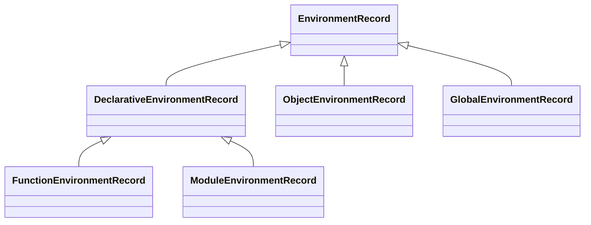

# 执行上下文与环境记录 (Execution Context & Environment Record) - 底层分析

本节将深入 ECMAScript 规范 (ECMA-262) 的核心，从底层规范算法和引擎实现角度剖析执行上下文机制。

## 1. ExecutionContext 完整字段表 (Clause 9.4)

在 ECMA-262 规范中，**Execution Context (执行上下文)** 并不是一个简单的对象，而是一个规范类型（Specification Type），用于跟踪 ECMAScript 代码的运行时评估。

一个执行上下文包含以下核心状态组件（字段）：

| 字段名 (Component) | 用途与描述 (Description) | 适用场景 |
| :--- | :--- | :--- |
| **codeEvaluationState** | 任何挂起、恢复和步进关联代码执行所需的内部状态。在引擎实现中通常对应程序计数器 (PC) 和寄存器状态。 | 所有执行上下文 |
| **Function** | 如果此上下文是在评估函数对象的代码，则此组件的值为该函数对象。如果是评估脚本或模块代码，则值为 `null`。 | 函数执行上下文 |
| **Realm** | 关联的 Realm Record（领域记录），提供该代码可访问的内置对象（Intrinsics）和全局环境。 | 所有执行上下文 |
| **ScriptOrModule** | 关联的 Script Record 或 Module Record。用于在需要时查找宿主环境中的特定信息。 | 所有执行上下文 |
| **LexicalEnvironment** | 标识用于解析代码中非 `var` 变量（如 `let`, `const`, `function`）和闭包的词法环境记录。 | 所有执行上下文 |
| **VariableEnvironment** | 标识用于解析代码中 `var` 变量声明的词法环境记录。 | 所有执行上下文 |
| **PrivateEnvironment** | 用于解析类中的私有名称（Private Names, `#propertyName`）。如果没有执行类代码，则为 `null`。 | 类内部的上下文 |

> [!NOTE]
> 在执行开始时，`LexicalEnvironment` 和 `VariableEnvironment` 通常指向同一个 Environment Record。只有在执行到块级作用域（Block Statement）或 `with` 语句时，`LexicalEnvironment` 才会被赋予一个新的 Environment Record，而 `VariableEnvironment` 保持不变。

## 2. 6种 EnvironmentRecord 类型详解 (Clause 9.1)

Environment Record (环境记录) 是一种规范类型，用于基于词法嵌套结构来定义变量和函数的关联。规范定义了层次化的环境记录抽象：



### 2.1 Declarative Environment Record (声明式环境记录)
绑定通过 `var`, `let`, `const`, `class`, `module`, `import`, 和 `function` 声明的标识符。
- **底层实现**：引擎（如 V8）通常将其实现为内存中的哈希表或者直接映射到 CPU 寄存器和栈槽 (Stack Slots)，以实现极速的变量访问。

### 2.2 Object Environment Record (对象式环境记录)
关联一个被称为 **binding object** 的普通对象。标识符的绑定直接对应于该对象的属性。
- **应用场景**：`with` 语句创建的环境，以及早期的全局对象绑定。
- **性能缺陷**：对绑定的查找需要触发对象的 `[[Get]]` / `[[HasProperty]]`，无法在编译期静态优化，这就是为什么 `with` 被严格模式禁用的底层原因。

### 2.3 Function Environment Record (函数环境记录)
继承自 Declarative Environment Record。
- **特有字段**：
  - `[[ThisValue]]`: 存储 `this` 的绑定值。
  - `[[ThisBindingStatus]]`: 可选值为 `"lexical"`, `"initialized"`, `"uninitialized"`。箭头函数的该值为 `"lexical"`。
  - `[[NewTarget]]`: 存储 `new.target` 的值。
- **特有方法**：`BindThisValue(V)`, `GetThisBinding()`。

### 2.4 Global Environment Record (全局环境记录)
唯一的一体化环境。逻辑上它是单个环境记录，但在内部它封装了：
1. 一个 **Object Environment Record**（绑定到真实的 Global Object，处理全局 `var` 和内置对象）。
2. 一个 **Declarative Environment Record**（处理全局 `let`/`const`/`class`，不会挂载到 Global Object 上）。

### 2.5 Module Environment Record (模块环境记录)
包含模块的顶级声明，并负责管理那些从外部模块显式导入的绑定（`import`）。
- **不可变引用**：导入的绑定在当前模块是间接引用（Indirect Binding），只读且动态跟踪源模块的导出值。

### 2.6 `with` 语句的特殊算法
当执行 `with (obj) { ... }` 时：
1. 创建一个新的 Object Environment Record，将其 `binding object` 设置为 `obj`。
2. 将这个新环境记录设为当前执行上下文的 `LexicalEnvironment`。
3. 其 `[[OuterEnv]]` 指向旧的 `LexicalEnvironment`。

## 3. Realm Record (Clause 9.3) 与 intrinsics

**Realm** 是一组内置对象 (Intrinsics)、一个全局环境、以及所有在这个领域中加载的 ECMAScript 代码及其状态的集合。

### 3.1 Intrinsics 内置对象列表
在引擎初始化 Realm 时，会预先分配一系列必须的内置对象（规范中的 Table 6）。例如：
- `%Array%`, `%Object%`, `%Function%`
- `%Promise%`, `%Math%`
- `%Object.prototype%`, `%Array.prototype%` 等。

> [!IMPORTANT]
> 每次打开新标签页、创建新的 `<iframe>`、或启动 Web Worker，浏览器都会实例化一个新的 Realm Record。两个 Realm 拥有的 `%Array%` 是内存中完全不同的两个函数对象，这是导致跨 iframe `instanceof Array` 失效的底层规范根源。

## 4. Running Execution Context 进栈/出栈算法描述

执行上下文的管理通过调用栈（Execution Context Stack）进行。

### 4.1 函数调用：上下文推入算法
当执行 `F()` 时，规范的抽象操作 `Call(F, V, [argumentsList])` 触发：
1. 断言：`F` 是可调用的。
2. 调用 `F.[[Call]](V, argumentsList)`：
   a. 创建新的执行上下文 `calleeContext`。
   b. 设置 `calleeContext` 的 `Function` 组件为 `F`。
   c. 设置 `calleeContext` 的 `Realm` 为 `F.[[Realm]]`。
   d. 创建 Local Environment Record (Function Environment Record)。
   e. 将 `calleeContext` 推入调用栈的顶部，使其成为 **Running Execution Context**。
   f. 执行函数体代码。

### 4.2 函数返回：上下文弹出算法
当函数执行到 `return` 或正常结束时：
1. 记录返回值。
2. 挂起当前的 **Running Execution Context**。
3. 从执行上下文栈中**弹出 (Pop)** 该上下文。
4. 恢复其下方的上下文（通常是调用者），将其重新设置为 Running Execution Context。
5. 将控制权和返回值传递给恢复的上下文。

## 5. 尾调用优化 (TCO) 的规范定义与引擎困境

### 5.1 规范定义 (Clause 14.6)
尾调用优化 (Tail Call Optimization) 要求在严格模式下，如果一个函数调用处于**尾部位置 (Tail Position)**，则不能为了该调用创建新的执行上下文。

**算法改变：**
- 正常的调用：Push new context -> Execute -> Pop context.
- 尾调用优化：**Pop current context FIRST** -> Push new context -> Execute.

这意味着，只要是尾调用，调用栈永远不会随着递归深度的增加而增长。

```javascript
"use strict";
function factorial(n, acc = 1) {
    if (n === 0) return acc;
    // 处于尾部位置的调用
    return factorial(n - 1, n * acc); 
}
```

### 5.2 为什么 V8 (Chrome) 难实现且最终放弃？
尽管 ES6 规范写入了 TCO，但目前只有 Safari (JavaScriptCore) 实现了它。V8 团队最终放弃了隐式 TCO，原因包括：

1. **Error.stack 破坏**：开发者极其依赖 `Error.stack` 来调试。TCO 提前弹出了调用者的执行上下文，导致堆栈跟踪丢失了中间的调用帧，这让线上 Bug 排查变得异常困难。
2. **性能权衡 (Performance Trade-offs)**：为了在引擎级别识别和替换栈帧，需要在 JIT 编译器（TurboFan）中引入复杂的逃逸分析和内存布局调整。在某些非尾调用的普通代码路径上，这种检查反而拖慢了整体性能。
3. **Shadow Stack 方案的开销**：为了解决报错堆栈问题，引擎必须维护一个独立于真实执行栈的“影子栈 (Shadow Stack)”专门用于错误堆栈，这带来了额外的内存开销。

> [!TIP]
> 鉴于主流引擎（V8, SpiderMonkey）并未实现隐式 TCO，在处理深层递归时，**务必手动使用蹦床函数（Trampoline）或循环**来防止 `RangeError: Maximum call stack size exceeded`。
