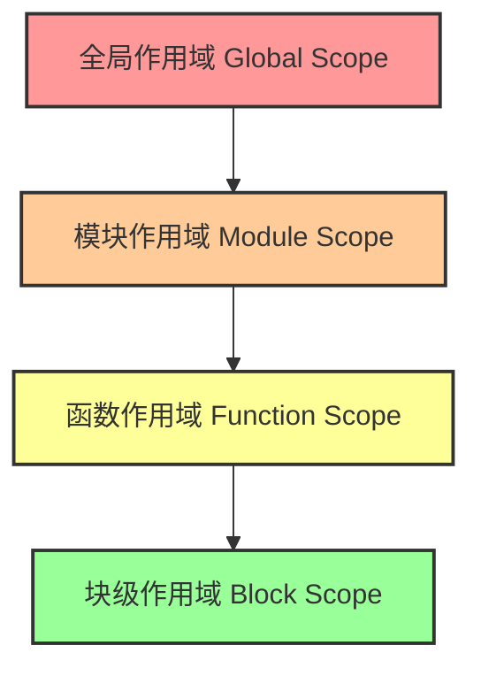

# 作用域链与闭包·TDZ - 使用维度

作用域（Scope）和闭包（Closure）是 ECMAScript 中控制变量可见性和生命周期的核心概念。理解它们是进阶高级前端开发的必经之路。

## 1. 4种作用域类型图示

ECMAScript 包含四种主要的作用域类型，它们通过**作用域链（Scope Chain）**向外层进行标识符解析。

### 1.1 作用域层级图解



*   **全局作用域**：脚本顶层，任何未在函数或块内部声明的变量都在此处。
*   **模块作用域**：在 ES Modules (`<script type="module">` 或 Node.js mjs) 中，顶层声明具有模块作用域，不会污染全局。
*   **函数作用域**：`var`, `let`, `const`, `function` 均被限定在声明它们的函数内部。
*   **块级作用域**：仅对 `let` 和 `const` 有效。由大括号 `{}` 界定（如 `if`, `for`, `while` 甚至孤立的代码块）。

> [!NOTE]
> `var` 没有块级作用域的概念，它会“穿透”块级作用域，直接绑定到最近的函数作用域或全局作用域上。

## 2. 5 种闭包工程模式

闭包是指**有权访问另一个函数作用域中变量的函数**。即使外部函数已经返回，闭包依然保留着对外部环境中变量的引用。

### 模式 1: 模块模式 (Module Pattern)
利用闭包隐藏内部实现细节（私有变量），暴露公共 API。
```javascript
const UserStore = (function() {
    // 私有变量
    let users = [];
    
    return {
        addUser(name) {
            users.push(name);
        },
        getUsers() {
            return [...users]; // 返回副本，防篡改
        }
    };
})(); // IIFE 创建闭包

UserStore.addUser("Alice");
console.log(UserStore.getUsers()); // ["Alice"]
console.log(UserStore.users); // undefined (外部无法直接访问)
```

### 模式 2: 状态封装器 (计数器)
用于创建彼此独立、互相不干扰的实例状态。
```javascript
function createCounter(initialStep = 1) {
    let count = 0; // 捕获变量
    return function() {
        count += initialStep;
        return count;
    };
}

const countA = createCounter(1);
const countB = createCounter(5);
console.log(countA(), countA()); // 1, 2
console.log(countB(), countB()); // 5, 10
```

### 模式 3: 局部应用与柯里化 (Partial Application / Currying)
通过闭包预先固化一部分参数，返回一个接收剩余参数的新函数。
```javascript
// 柯里化一个生成 URL 的工具函数
function createUrlGenerator(protocol, domain) {
    return function(path) {
        return `${protocol}://${domain}/${path}`;
    };
}

const getApiUrl = createUrlGenerator('https', 'api.example.com');
console.log(getApiUrl('users')); // https://api.example.com/users
console.log(getApiUrl('posts')); // https://api.example.com/posts
```

### 模式 4: 防抖 (Debounce)
工程中极度常用的闭包模式，用于限制事件（如 resize, scroll）的高频触发。
```javascript
function debounce(fn, delay) {
    let timerId = null; // 在闭包中维持 timerId
    
    return function(...args) {
        // 如果再次触发，清除之前的定时器重新计时
        if (timerId) clearTimeout(timerId);
        
        timerId = setTimeout(() => {
            fn.apply(this, args);
            timerId = null;
        }, delay);
    };
}
```

### 模式 5: 记忆化缓存 (Memoization)
利用闭包缓存高耗时函数的执行结果。
```javascript
function memoize(fn) {
    const cache = new Map(); // 闭包中的缓存池
    return function(...args) {
        const key = JSON.stringify(args);
        if (cache.has(key)) {
            return cache.get(key);
        }
        const result = fn.apply(this, args);
        cache.set(key, result);
        return result;
    };
}
```

## 3. TDZ (暂时性死区) 所有触发场景

TDZ (Temporal Dead Zone) 指的是从**作用域创建（进入块级或函数）**开始，直到**变量被明确初始化**为止的这部分代码区域。在此区域内访问该变量会抛出 `ReferenceError`。

### 场景 1：let/const 声明之前访问
```javascript
{
    // 进入块级作用域，TDZ 开始
    console.log(typeof a); // ReferenceError
    let a = 1; // a 初始化，TDZ 结束
}
```

### 场景 2：class 声明之前访问
`class` 声明与 `let`/`const` 行为完全一致，同样存在 TDZ。
```javascript
const instance = new MyClass(); // ReferenceError
class MyClass {} 
```

### 场景 3：默认参数的先后引用
函数参数在求值时也有自己的局部作用域和 TDZ（从左到右初始化）。
```javascript
// x 初始化时，y 还在 TDZ 中
function doMath(x = y, y = 2) { 
    return x + y; 
}
doMath(); // ReferenceError: Cannot access 'y' before initialization

// 反过来可以
function doMath2(x = 1, y = x) {
    return x + y;
}
doMath2(); // 2
```

## 4. for 循环 var vs let 经典陷阱详解

这几乎是闭包历史上最著名的坑。

### 4.1 `var` 导致的共享绑定陷阱
```javascript
for (var i = 0; i < 3; i++) {
    setTimeout(() => {
        console.log(i); 
    }, 100);
}
// 输出: 3, 3, 3
```
**原因**：`var i` 是在函数（或全局）作用域上的一个单一绑定。三次循环注册的 `setTimeout` 回调**闭包捕获的是同一个 `i` 的引用**。循环结束时 `i` 变成了 3。回调执行时，访问到的自然是 3。

### 4.2 `let` 的规范魔法
```javascript
for (let i = 0; i < 3; i++) {
    setTimeout(() => {
        console.log(i);
    }, 100);
}
// 输出: 0, 1, 2
```
**原因**：ECMAScript 规范在设计 `for` 循环与 `let` 时做了一个极大的特殊处理：**每次迭代，都会创建一个全新的词法环境（Lexical Environment）**。每个回调函数捕获的都是属于当前那次迭代的独立的 `i` 的副本。

## 5. 闭包内存泄漏场景与规避

虽然闭包极其强大，但滥用或不经意的使用会导致内存无法回收。

### 5.1 事件监听器未移除
如果在组件挂载时注册了闭包监听器，组件销毁时未移除，闭包及其捕获的所有组件状态都会泄漏。
```javascript
function attachHandler(element, hugeData) {
    // 这个闭包捕获了 hugeData 和 element
    element.addEventListener('click', function() {
        console.log(hugeData.id);
    });
    // 规避：在不需要时必须 removeEventListener，并置空巨大引用。
}
```

### 5.2 定时器内部捕获
```javascript
function startPolling() {
    const data = new Array(10000).fill('leak');
    setInterval(() => {
        // 闭包捕获了 data
        console.log(data[0]); 
    }, 1000);
}
// 如果应用中不断调用 startPolling 而不清空 interval，会导致疯狂泄漏。
```

> [!TIP]
> **排查闭包泄漏的工程技巧**：
> 1. 在 Chrome DevTools 的 Memory 面板中截取 Heap Snapshot（堆快照）。
> 2. 对比两个时间点的快照。
> 3. 过滤 `Detached HTML elements` 和系统闭包 (`system / Context`) 以定位未被释放的环境记录。
