# 2026 资深大前端全栈专家知识体系脑图 & 5个月攻坚指南

> 本指南旨在构建全景式、高密度的现代大前端 + 全栈 + AI 原生架构认知地图， 内落地、包含 5 大阶段性实战项目的攻坚路线图。

---

## 零、 知识体系总览图 (Mermaid Mindmap)

```mermaid
graph TB
    classDef main fill:#2563eb,stroke:#1d4ed8,stroke-width:2px,color:#ffffff,font-weight:bold
    classDef pillar fill:#1e293b,stroke:#475569,stroke-width:2px,color:#f8fafc,font-weight:bold
    classDef item fill:#0f172a,stroke:#334155,stroke-width:1px,color:#cbd5e1

    Root["<b> 资深大前端全栈专家知识体系 </b>"]:::main

    subgraph CoreDomain["核心语言与全栈基石 (Core & Full-Stack)"]
        direction TB
        P1["1. 核心语言与 Web 物理层"]:::pillar
        P1 --> P1_1["V8 GC & JIT / Event Loop / 闭包内存"]:::item
        P1 --> P1_2["TS 高级条件类型 / infer / 契约设计"]:::item
        P1 --> P1_3["Modern CSS & 浏览器渲染 Pipeline"]:::item
        P1 --> P1_4["Web Worker / WebGPU / Rust Wasm"]:::item

        P2["2. 现代框架与大前端跨端"]:::pillar
        P2 --> P2_1["React 19 / RSC / Next.js 15 PPR"]:::item
        P2 --> P2_2["Vue 3 Vapor Mode & 响应式源码"]:::item
        P2 --> P2_3["Tauri 2.0 / React Native / 鸿蒙 ArkTS"]:::item

        P3["3. Node.js 与全栈服务端"]:::pillar
        P3 --> P3_1["Libuv 架构 / Bun / Deno 运行时"]:::item
        P3 --> P3_2["NestJS / Fastify / oRPC API 契约"]:::item
        P3 --> P3_3["PostgreSQL / Redis / pgvector 向量库"]:::item
        P3 --> P3_4["Serverless & Edge 边缘计算"]:::item
    end

    subgraph AdvancedDomain["架构工程与 AI 攻坚 (Architecture & AI)"]
        direction TB
        P4["4. AI 原生前端架构"]:::pillar
        P4 --> P4_1["Streaming UI & 富媒体流式 Parser"]:::item
        P4 --> P4_2["Generative UI & 沙箱隔离 (iframe)"]:::item
        P4 --> P4_3["WebGPU 端侧推理 & 端侧 RAG"]:::item
        P4 --> P4_4["Agentic Canvas 画布 & Copilot 插件"]:::item

        P5["5. 工程化架构与运维"]:::pillar
        P5 --> P5_1["Rspack / Vite / Module Federation v2"]:::item
        P5 --> P5_2["pnpm Workspace + Turborepo Monorepo"]:::item
        P5 --> P5_3["Core Web Vitals & AI 前端安全"]:::item
        P5 --> P5_4["Docker / CI/CD / OpenTelemetry / Sentry"]:::item

        P6["6. 计算机底层与专家软实力"]:::pillar
        P6 --> P6_1["HTTP/3 / WebSockets / WebRTC P2P"]:::item
        P6 --> P6_2["数据结构与算法 / 系统架构 (DDD)"]:::item
        P6 --> P6_3["技术领导力 / 规范制定 / ROI 赋能"]:::item
    end

    Root ==> CoreDomain
    Root ==> AdvancedDomain
```

---

## 一、 知识体系全景脑图 (Global Knowledge Mindmap)

### 1. 核心语言与 Web 平台物理层 (Core Languages & Web Platform)

#### 1.1 JavaScript (ESNext) & V8 引擎物理底层
- **V8 内存模型与堆栈**:
  - 内存堆区：New Space（新生代）、Old Space（老生代）、Large Object Space（大对象区）、Code Space（代码区）。
  - 栈区与执行上下文：Lexical Environment（词法环境）、Variable Environment（变量环境）、Scope Chain（作用域链）、`this` 动态绑定机制。
- **垃圾回收 (GC) 算法原理**:
  - 新生代垃圾回收：Scavenger 算法（Cheney 复制算法），分为 From-Space 与 To-Space。
  - 老生代垃圾回收：Mark-Sweep（标记清除）、Mark-Compact（标记整理）、Incremental Marking（增量标记，减少 Stop-The-World）、Concurrent GC（并发回收）。
  - 内存泄漏排查：未清除的 Timer、DOM 游离节点引用、全局变量泄漏、闭包未释放 Context，使用 Chrome DevTools Heap Snapshot 诊断分析。
- **JIT 编译与执行引擎**:
  - Ignition 解释器生成 Bytecode，TurboFan 优化编译器针对热点代码（Hot Code）生成高效 Machine Code。
  - Deoptimization（反优化）触发条件与隐藏类（Hidden Classes）、Inline Caches（内联缓存，Polymorphic/Morphic）优化技巧。
- **异步与流式并发范式**:
  - Event Loop 深度原理：Microtasks（`Promise.then`、`MutationObserver`、`process.nextTick`）与 Macrotasks（`setTimeout`、`MessageChannel`、`requestAnimationFrame`）调度优先级。
  - 原生 Web Streams：`ReadableStream`、`WritableStream`、`TransformStream` 增量数据流控制与背压（Backpressure）机制。

#### 1.2 TypeScript 深度进阶与类型编程
- **高级类型系统与型变**:
  - 条件类型：`T extends U ? X : Y` 条件判断与 `infer` 关键字类型推断（如提取函数返回值、Promise 解包）。
  - 映射类型与模板字面量：Key Remapping（`in keyof`）、Template Literal Types（如 `EventName<`${Domain}:${Action}`>`）。
  - 协变与逆变 (Covariance & Contravariance)：函数参数逆变、返回值协变，`strictFunctionTypes` 选项原理。
- **类型安全契约与工程实践**:
  - 运行时 Schema 校验：Zod、TypeBox、Valibot 的 Schema 编译与类型推导。
  - 端到端类型安全 API：基于 oRPC / tRPC / OpenAPI 实现前后端全链路 TypeScript 类型推导。
  - 高级工程配置：`tsconfig` 声明文件（`.d.ts`）、`paths` 路径映射、Nominal Typing 模拟（Brand Types）。

#### 1.3 Modern CSS & 浏览器渲染管线 (Rendering Pipeline)
- **现代布局与 CSS 规范**:
  - 布局引擎：Flexbox 弹性盒子、Grid 网格布局、Container Queries（容器查询）、Subgrid（子网格）。
  - 现代动画与视图过渡：View Transitions API（原生页面/视图过渡动画）、Scroll-driven Animations（滚动驱动动画）。
  - 现代化样式工程：Tailwind CSS v4（基于 Rust 引擎 Lightningcss）、CSS Modules、CSS-in-JS (StyleX / Emotion)、Backdrop Filters / Glassmorphism 设计系统。
- **渲染 Pipeline 性能优化**:
  - 渲染五大步骤：DOM Tree + CSSOM Tree -> Render Tree -> Layout (Reflow 重排) -> Paint (Repaint 重绘) -> Composite (复合层)。
  - GPU 硬件加速：Compositing Layer（提升层条件：`will-change`、`transform 3d`、`opacity` 动画），避免 Layout Thrashing（强制同步布局）。

#### 1.4 Web Native APIs & WebAssembly (Wasm)
- **多线程与并发计算**:
  - Web Workers / Shared Worker / Service Worker 线程通信。
  - `SharedArrayBuffer` 与 `Atomics` 原子锁/信号量实现线程间共享内存同步。
- **硬件与离线 Storage**:
  - WebGPU 架构：WGSL 着色器语言、计算管线 (Compute Pipeline)、GPU 算力加速。
  - Canvas 2D 离屏绘制 (`OffscreenCanvas`)、Service Worker PWA 离线策略（Stale-While-Revalidate）、IndexedDB 高性能本地存储。
- **WebAssembly (Wasm)**:
  - Rust / C++ 编译至 Wasm (wasm-bindgen / Emscripten)，Wasm 线性内存 (Linear Memory) 共享。
  - 适用场景：高密加密解密、图像/视频编解码（FFmpeg.wasm）、客户端大文件 Hash 分片计算。

---

### 2. 现代框架与大前端跨端全景 (Modern Frameworks & Cross-Platform)

#### 2.1 React 19 & Next.js 15 全栈生态
- **React 19 核心革命**:
  - React Compiler (Forget 项目)：自动记忆化编译，摒弃手动 `useMemo` / `useCallback`。
  - Server Components (RSC)：服务端组件渲染与 Flight Protocol 序列化数据流。
  - Server Actions & `useActionState`：端到端表单突变与无缝 RPC 交互，`use()` API 异步 Promise 读取。
- **Next.js 15 全栈 SSR 架构**:
  - App Router 物理路由、Streaming SSR (`<Suspense>`)、PPR (Partial Prerendering) 静态/动态混合渲染。
  - ISR (Incremental Static Regeneration) 增量静态再生、RSC 缓存控制与 `revalidatePath` / `revalidateTag`。
- **现代状态管理与数据流**:
  - 客户端状态：原子化与切片状态（Zustand / Jotai）。
  - 服务端数据流：服务端缓存与 Fetch 数据自动重试/突变（TanStack Query v5 / React Query）。

#### 2.2 Vue 3 生态与编译时优化
- **Vue 3 源码与响应式**:
  - Composition API 依赖收集（`track` / `trigger`）、`Proxy` 深度拦截与 `RefImpl` 原理。
- **Vapor Mode & Nuxt 3**:
  - Vapor Mode：无 Virtual DOM 的直接 DOM 操作编译模式，零 VDOM 开销。
  - Nuxt 3 全栈生态：Nitro 引擎、全栈 SSR/SSG 与 Server Routes 接口开发。

#### 2.3 大前端跨端演进与原生架构
- **桌面端 (Desktop)**:
  - Electron：主进程与渲染进程 IPC 通信、Context Isolation 沙箱安全。
  - Tauri 2.0：Rust 后端 + OS Native Webview 架构，极小安装包体积与极致安全性。
- **移动端 (Mobile & IoT)**:
  - React Native：Fabric C++ 核心渲染管线、TurboModules 延迟加载 JSI 原生绑定。
  - Flutter 3：Impeller 硬件加速渲染引擎、Dart AOT 编译。
  - HarmonyOS (鸿蒙)：ArkTS 语言、ArkUI 声明式 UI 状态管理与原生 capabilities 接入。
- **跨端小程序**:
  - Taro 4 / Uniapp 虚拟 DOM 适配层与小程序 AST 语法编译转化机制。

---

### 3. Node.js 与全栈服务端架构 (Node.js & Full-Stack Backend)

#### 3.1 Node.js 运行时与新兴 Runtime
- **Node.js 架构**:
  - V8 + Libuv 双引擎架构、Libuv 线程池（Threadpool `UV_THREADPOOL_SIZE`）。
  - C++ 原生扩展（N-API / Node-Addon-API）、Stream 模块背压（Backpressure）机制。
- **新兴 Runtime 选型**:
  - Bun：Zig 语言编写，原生内置高性能包管理器、bundler 与 HTTP / WebSocket 服务。
  - Deno：Rust + V8，原生支持 TypeScript，默认开启安全沙箱与 Web 标准 API。

#### 3.2 服务端框架与通信协议
- **企业级服务端框架**:
  - NestJS：依赖注入（DI）、控制反转（IoC）、装饰器模式与领域驱动设计（DDD）规范。
  - Fastify / Hono：极轻量、Edge 运行节点优先的高并发 Web 框架。
- **通信范式全景**:
  - RESTful API (OpenAPI 3.0)、GraphQL (Resolver, DataLoader 解决 N+1 查询)。
  - gRPC (HTTP/2 + Protobuf 高性能二进制通信)、oRPC (TypeScript 契约推导)。
  - 实时通信：SSE (Server-Sent Events) 与 WebSockets。

#### 3.3 数据持久化、缓存与向量数据库
- **数据库与缓存**:
  - PostgreSQL / MySQL：ACID 事务、B-Tree / GIN 索引优化、复杂 JSONB 检索。
  - Redis：AOF/RDB 持久化、Redlock 分布式锁、缓存雪崩/击穿/穿透防护。
- **ORM & 向量数据库**:
  - ORM：Prisma (Schema 驱动与类型生成)、Drizzle ORM (SQL-like 极速执行)。
  - 向量数据库：pgvector、Qdrant (HNSW 索引、Cosine 余弦相似度向量检索)。

#### 3.4 Edge & Serverless 架构
- Cloudflare Workers / Vercel Edge Runtime 边缘节点计算（V8 Isolates 启动，< 1ms 冷启动）。
- Serverless FaaS 架构、冷启动（Cold Start）预热与无状态函数设计。

---

### 4. AI 原生前端架构 (AI-Native & Agentic Architecture)

#### 4.1 流式 UI 与增量渲染 (Streaming UI)
- **流式协议处理**:
  - SSE (Server-Sent Events)、HTTP Chunked Transfer-Encoding、`ReadableStream` 增量解码与 `AbortController` 打断机制。
- **富媒体流式 Parser**:
  - 打字机平滑动画、Markdown 流式补全（补齐未闭合 HTML/Markdown 标签）、KaTeX 数学公式渲染、Monaco / Prism 流式代码高亮、Mermaid 图表实时渐进绘制。

#### 4.2 生成式 UI (Generative UI / Dynamic UI)
- **结构化 UI 动态生成**:
  - Vercel AI SDK (`streamUI` / `streamObject`)、根据 LLM 输出的 JSON Schema 动态匹配并装配 React 组件库。
- **安全与沙箱隔离**:
  - 沙箱 `iframe` (`sandbox="allow-scripts"` 权限裁剪)、DOMPurify XSS 过滤、Shadow DOM 样式隔离。

#### 4.3 Tool Calling & Agent 交互范式
- **Function Calling 交互图谱**:
  - 状态机表达：Thinking（思考中）/ Tool Executing（工具执行中）/ Completed（完成）/ Failed（异常）。
- **人机协同 (Human-in-the-Loop)**:
  - 人工授权阻断确认卡片、可干预提问、回退与多分支尝试机制。

#### 4.4 端侧 AI 与浏览器端计算 (On-Device AI)
- **WebGPU 浏览器推理**:
  - WebLLM (TVM 编译引擎)，浏览器端本地加载并运行 Llama 3 / Qwen 2.5 / Phi-3 等小语言模型。
- **端侧 Embeddings & 小模型**:
  - Transformers.js (本地计算文本/图像 Embedding)、ONNX Runtime Web (Wasm + WebGPU 后端)、Chrome Built-in AI (Prompt API)。
- **端侧离线 RAG 知识库**:
  - Web Worker 客户端 PDF/Markdown 分块 (Chunking) + IndexedDB + HNSW 向量索引 + BM25 混合全文检索。

#### 4.5 Agentic Canvas & 可视化编排
- **Multi-Agent 编排图谱**:
  - React Flow / AntV X6 可视化编排与 Agent 状态节点流转。
- **无限画布 (Infinite Canvas)**:
  - Tldraw Engine / WebGL / PixiJS 视口变换 (Pan & Zoom)、空间索引 (R-Tree)、框选与矢量协同绘制。
- **浏览器 Copilot 插件**:
  - Chrome Extension MV3 (SidePanel API, Content Scripts 划词交互, Background Service Worker)。

---

### 5. 工程化、架构设计与 DevOps (Engineering & Infrastructure)

#### 5.1 现代构建与微前端体系
- **极速构建工具链**:
  - Rspack (Rust 编写的高性能 Webpack 替代品)、Turbopack、Vite (ESbuild + Rollup)。
  - Tree Shaking 原理：副作用 `sideEffects` 识别、Scope Hoisting（作用域提升）。
- **微前端 2.0 架构**:
  - Module Federation v2：Runtime 模块动态共享与依赖协商机制。
  - 微前端容器：qiankun / Micro App 沙箱隔离与路由分发。

#### 5.2 Monorepo 与代码库基础设施
- **包管理与任务调度**:
  - pnpm Workspace（基于 Symlink 的极速依赖图）、Turborepo / Nx（增量构建缓存、并行任务图 Pipeline 调度）。
- **规范与发布**:
  - npm package CI/CD 发布流程、语义化版本（SemVer）、Changesets 自动生成更新日志。

#### 5.3 性能工程 (Core Web Vitals 深度调优)
- **Web Vitals 核心指标**:
  - LCP（最大内容渲染 < 2.5s）、INP（交互延迟 < 200ms）、CLS（视觉累积偏移 < 0.1）。
- **性能排查与 Diagnostics**:
  - Chrome DevTools Performance Trace 逐帧剖析、Heap Snapshot 内存泄漏查找、Lighthouse CI 自动化门禁。

#### 5.4 前端安全防御
- **传统安全防护**:
  - CSP (Content Security Policy) 标头策略、XSS 防护 (HTML 实体编码与 DOM Safe APIs)、CSRF (SameSite Cookie 属性)、CORS 跨域配置。
- **AI 前端专有安全**:
  - Prompt Injection（提示词注入）客户端输入检测、Generative UI 沙箱权限隔离。

#### 5.5 DevOps 与云原生全栈监控
- **部署与容器化**:
  - Docker 镜像多阶段构建（Multi-stage build）体积优化、Nginx 高性能静态托管/反向代理/Brotli 压缩、GitHub Actions CI/CD。
- **可观测性与监控 (Observability)**:
  - Sentry 实时异常堆栈追溯、OpenTelemetry 全栈链路追踪、RUM (Real User Monitoring) 真实用户性能埋点收集。

---

### 6. 计算机底层科学与专家软实力 (CS Fundamentals & Leadership)

#### 6.1 计算机网络协议
- **传输层与应用层协议**:
  - HTTP/1.1 vs HTTP/2 (多路复用 Multiplexing, 头部压缩 HPACK) vs HTTP/3 (QUIC 协议, UDP 传输, 0-RTT 握手)。
- **实时通信协议**:
  - WebSockets 握手与心跳机制、WebRTC (ICE 候选者, STUN/TURN 穿透, SDP 协商, P2P 音视频传输)。
- **安全传输**:
  - TLS 1.3 握手流程、数字证书与 PKI 体系。

#### 6.2 数据结构与算法
- **核心数据结构**:
  - Trees (AST / DOM Tree / B-Tree), Graphs (Dependency Graph / State Machine), Trie (字典树), Heap (优先队列), Hash Map.
- **核心算法思想**:
  - 动态规划 (DP), 滑动窗口 (Sliding Window), 双指针, LRU / LFU 缓存算法, 深度/广度优先搜索 (DFS/BFS).

#### 6.3 系统架构设计模式
- **架构设计模式**:
  - 领域驱动设计 (DDD) 划分限界上下文 (Bounded Context)、Clean Architecture 干净架构解耦业务与底层框架。
- **可靠性设计**:
  - 熔断器模式 (Circuit Breaker)、防抖与节流、优雅降级与优雅重试、全链路跟踪 ID (Trace ID) 贯穿。

#### 6.4 技术领导力与业务 ROI
- **选型与标准规范**:
  - 制定技术选型评估矩阵、编写团队 TypeScript / React / Code Review 标准规范。
- **业务赋能与 ROI**:
  - 建立前端性能与稳定性监控大盘、度量技术重构对业务 Conversion Rate 与开发效率 (ROI) 的影响。

---

## 二、 3 个月（12 周）攻坚路线图与实战项目

| 阶段 | 时间 | 核心目标 | 对应阶段实战项目 |
| :--- | :--- | :--- | :--- |
| **Stage 1** | 第 1-4 周 | 现代前端基石与全栈工程核心 | **项目 1: 全栈高性能云端笔记与数据看板系统** |
| **Stage 2** | 第 5-8 周 | AI 原生前端架构与端侧大模型集成 | **项目 2: AI 驱动的可视化 Artifact 智能工作台** |
| **Stage 3** | 第 9-10 周 | Agent 交互范式、画布图形与 Copilot | **项目 3: 基于无限画布的多 Agent 协同与网页 Copilot** |
| **Stage 4** | 第 11-12 周 | 企业级架构、安全、性能与全栈收官 | **项目 4: 企业级模块化 AI SaaS 平台与全栈作品集** |

---

### Stage 1 (第 1 - 4 周): 现代前端基石与全栈工程核心

#### 学习重点与技术点
- **W1 (JS/TS 核心原理)**: Event Loop 深入、V8 垃圾回收、闭包与内存泄漏、TS 高级条件类型与 `infer`、Type-safe API 契约.
- **W2 (CSS & Web APIs)**: Tailwind CSS v4, Container Queries, Flexbox/Grid 响应式设计, Web Workers, SSE, Web Vitals 调试与优化.
- **W3 (React 19 & Next.js 15)**: RSC, Server Actions, PPR (Partial Prerendering), App Router, Zustand, TanStack Query v5.
- **W4 (工程化与 Monorepo)**: Vite / Rspack, Monorepo (pnpm + Turborepo), ESLint v9, GitHub Actions CI/CD.

#### 🎯 Stage 1 实战项目：全栈高性能云端笔记与数据看板系统
- **项目描述**: 打造一个响应速度极快、支持大容量数据与实时同步的全栈 Markdown 云端笔记与数据可视化看板。
- **技术栈**: Next.js 15 + React 19 + TypeScript + Tailwind CSS + Zustand + TanStack Query + PostgreSQL (Prisma) + Turborepo.
- **核心功能**:
  1. 支持 SSE 实时多端同步与长文档分块加载；
  2. 实现 10 万级列表数据虚拟化渲染与虚拟滚动；
  3. 支持 IndexedDB 离线暂存与网络恢复增量同步；
  4. Monorepo 模块拆分（UI 组件包、API 契约包、数据分析包）；
  5. 优化 Web Vitals 指标 (LCP < 1.2s, INP < 50ms).

---

### Stage 2 (第 5 - 8 周): AI 原生前端架构与大模型端侧集成

#### 学习重点与技术点
- **W5 (AI 流式协议与 Vercel AI SDK)**: SSE / ReadableStream 原生解析、NDJSON、Vercel AI SDK (`useChat`, `streamText`, `streamObject`).
- **W6 (Generative UI 与结构化渲染)**: LLM 输出 JSON 渲染 React 组件库、Markdown+Math+Code+Chart 实时渲染、Tool Call 三态交互.
- **W7 (端侧 AI 与 WebGPU)**: WebLLM 在浏览器运行 Llama3/Qwen2.5 本地推理, Transformers.js 本地 Embeddings, Chrome Prompt API.
- **W8 (前端 RAG 与离线知识库)**: 客户端 PDF/Markdown 智能 Chunking (Web Worker), IndexedDB + Vector Search 向量检索, 语音交互 (Web Audio API).

#### 🎯 Stage 2 实战项目：AI 驱动的可视化 Artifact 智能工作台
- **Project 描述**: 借鉴 Claude Artifacts / ChatGPT Canvas 模式，开发一个集多模型流式对话、动态 Generative UI 渲染、端侧离线 RAG 检索与代码实时预览一体的智能工作台。
- **技术栈**: Next.js 15 + Vercel AI SDK + WebGPU (WebLLM) + Transformers.js + Tailwind CSS + Shadcn UI + IndexedDB.
- **核心功能**:
  1. 多模型 SSE 流式对话，实时分割思考过程 (Reasoning stream) 与最终回答；
  2. **Artifact 智能预览**: 动态捕获 LLM 生成的 HTML/React/SVG/Mermaid 代码并在沙箱 Iframe 中即时渲染预览；
  3. **Generative UI 动态表单**: 根据提示词自动生成可交互的表单与数据图表；
  4. **完全离线 PDF 问答 (Browser RAG)**: 用户上传 PDF 后，利用 Web Worker + Transformers.js 生成向量并存入 IndexedDB，无需服务端进行端侧语义检索与问答。

---

### Stage 3 (第 9 - 10 周): Agent 交互范式、画布图形与 Copilot 插件

#### 学习重点与技术点
- **W9 (Agentic UI 与无限画布)**: React Flow / AntV X6 Agent 任务可视化图谱、思维链日志追踪、Canvas (Tldraw / PixiJS) 交互与框选.
- **W10 (Chrome Copilot 插件)**: Chrome Extension MV3, SidePanel API, Content Scripts 网页划词, Shadow DOM 隔离, WebSocket 协同.

#### 🎯 Stage 3 实战项目：基于无限画布的多 Agent 协同创作与网页 Copilot 插件
- **项目描述**: 构建一个能够读取任意网页上下文的 Chrome 浏览器 Copilot 插件，以及配套的无限画布可视化 Agent 创作工作台。
- **技术栈**: React 19 + React Flow / Tldraw + Chrome Extension MV3 + LangChain.js / Agent Protocol + WebSockets.
- **核心功能**:
  1. **Chrome Extension SidePanel**: 在任意网页右侧唤出 AI 助手，一键提取网页正文/表格/代码并进行总结或重构；
  2. **网页元素划词 Copilot**: 选择网页任意文本或 DOM 节点，弹框生成解释、翻译或一键投递至无限画布；
  3. **无限画布多 Agent 编排**: 在 Tldraw/React Flow 画布上拖拽与连接多个 Agent 节点（如：检索 Agent -> 写作 Agent -> 排版 Agent），实时可视化观察 Agent 间的传递过程与中间状态。

---

### Stage 4 (第 11 - 12 周): 企业级架构、安全、性能与全栈收官

#### 学习重点与技术点
- **W11 (企业级架构与 AI 前端安全)**: 微前端 Module Federation v2, WebAssembly (Rust -> Wasm) 复杂计算、Prompt Injection 客户端防护、Generative UI 沙箱隔离.
- **W12 (E2E 测试与作品集打包)**: Playwright 自动化测试, Vitest 单元测试, 性能 Diagnostics (Heap Snapshot), Monorepo 全栈作品集集成为展示网站.

#### 🎯 Stage 4 实战项目：企业级模块化 AI SaaS 平台与全栈作品集
- **项目描述**: 整合前 3 个阶段的所有核心组件与微应用，采用 Monorepo 与微前端架构，打包构建一个达到企业级交付标准的 AI 原生 SaaS 聚合平台及对外展示作品集。
- **技术栈**: Turborepo + Next.js 15 + Module Federation + Playwright + Rust (Wasm) + Vercel / Docker.
- **核心功能**:
  1. **微前端集成**: 将 Stage 1 看板、Stage 2 Artifact 工作台、Stage 3 画布协同无缝嵌入统一的主框架中；
  2. **Wasm 高速加速**: 集成 Rust 编译的 Wasm 模块用于客户端大文件加密与 PDF 极速解析；
  3. **企业级安全防御**: 实现完整的 CSP 策略、Prompt 脱敏与 Dynamic Component 运行期安全沙箱；
  4. **全自动化 CI/CD 与 E2E 覆盖**: 配置 GitHub Actions 自动跑完 Vitest 与 Playwright 测试，自动部署至云端，作为 3 个月攻坚的亮眼 Portfolio。

---

## 三、 资深专家的成长与进阶指南

1. **建立“纵深+横向”的技术 T 型结构**
   - **纵深**: 深入 V8 引擎机制、浏览器渲染管线与框架核心实现（如 React 19 RSC / Next.js 15 源码解析），能够清晰理解技术方案中的能力边界与设计权衡（Trade-offs）。
   - **横向**: 拓宽大前端全栈视界，涵盖 AI 原生架构（Streaming UI, Generative UI, On-Device WebGPU）、Node.js 全栈服务端与端到端类型安全（oRPC, Prisma）。
2. **注重项目的实战落地与 ROI 评估**
   - 按照 3 个月攻坚路线图依次实现 4 大核心项目，用可运行的优质工程项目与指标数据（LCP < 1.2s, INP < 50ms, 端侧 AI 离线推理）证明资深专家的技术落地方案。
