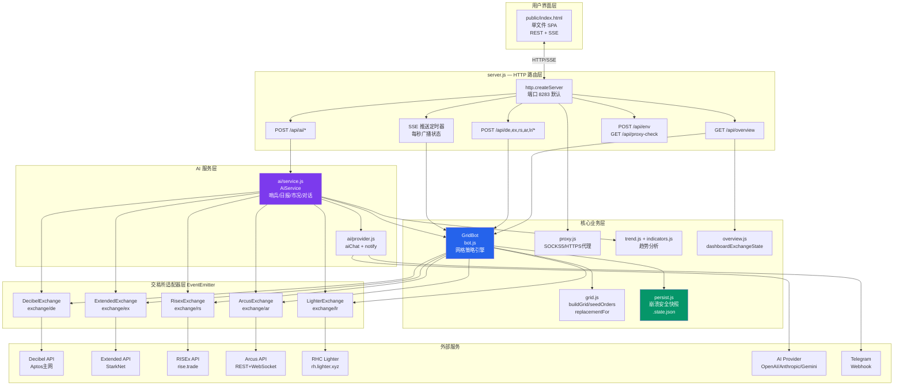
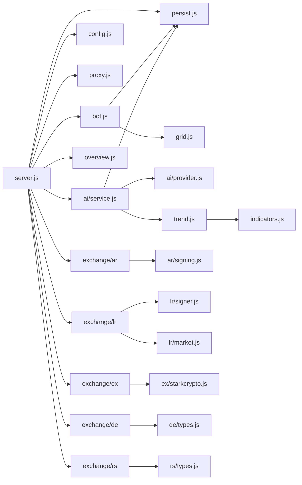

# 项目架构文档

> 五交易所整合网格交易机器人 · 架构全览

---
## 一、项目概述

本项目是一个**五交易所整合网格交易机器人**，通过统一仪表盘同时管理 Decibel、Extended、RISEx、Arcus、RHC Lighter 五个 DeFi 永续合约交易所上的算术网格策略。

- **后端**：Node.js（>=v20）原生 HTTP 服务器，ESM 模块体系

- **前端**：单文件 SPA（`public/index.html`），通过 REST + SSE 与后端通信

- **运行模式**：`paper`（模拟）/ `live`（实盘），每所独立配置

---
## 二、顶层目录结构

```
project-root/

├── src/

│ ├── server.js # HTTP 服务器 & 路由入口（662 行）

│ ├── bot.js # GridBot 核心逻辑（1536 行）

│ ├── grid.js # 网格数学纯函数

│ ├── config.js # 配置加载 .env + 环境变量

│ ├── persist.js # 崩溃安全状态持久化

│ ├── proxy.js # 多交易所代理管理

│ ├── trend.js # 趋势分析 EMA/ATR/线性回归

│ ├── indicators.js # 技术指标

│ ├── overview.js # 仪表盘状态聚合

│ ├── ai/

│ │ ├── service.js # 哨兵/日报/市况/对话/出区间建议

│ │ └── provider.js # 多AI提供商统一接口+通知推送

│ └── exchange/

│ ├── de/ # Decibel（Aptos链）

│ ├── ex/ # Extended（StarkNet）

│ ├── rs/ # RISEx（REST+WebSocket）

│ ├── ar/ # Arcus（Ed25519+WebSocket）

│ └── lr/ # RHC Lighter（Python签名器）

├── public/

│ └── index.html # 单文件前端 SPA（约159 KB）

├── scripts/

│ ├── preflight.js # 启动前配置检测

│ ├── release-audit.js # 发布安全审计

│ └── windows-launcher.ps1

├── test/ # 六个独立测试文件（不依赖框架）

├── docs/ # 文档目录

├── .env / .env.example

├── .state.json # 运行时状态快照（自动维护）

└── package.json # 依赖：zod/undici/@aptos-labs/ts-sdk/@decibeltrade/sdk

```

---
## 三、系统架构图

  



---
  
## 四、核心模块详解

### 4.1 GridBot（bot.js）

网格策略引擎，是整个系统最复杂的模块（1536 行）。
#### 状态机

```

未启动 running=false

│

├─ start(cfg) ─────────────────► 运行中 running=true

│ 1. 保证金预检 / 手续费检查 │

│ 2. cancelAllConfirmed 清老单 │←── fill 事件

│ 3. getPrice 获取初始价 │ _handleFill

│ 4. seedOrders 铺初始梯子 │ replacementFor

│ 5. 启动对账定时器 30s │ _place

│ │←── price 事件

├─ resume(snap) ─────────────────► │ _handlePrice

│ 崩溃恢复接管挂单 │ 出区间? close/recover

│

├─ stop() ──────────────────────► 已停止

│ pauseTradingRuntime

│ cancelAllConfirmed

│ closePosition 可选

│

└─ startRecovery(cfg) ─────────► 回收模式 recovery=true

只减仓阶梯，不开新仓

```

  

#### 关键安全机制

  

| 机制 | 实现位置 | 说明 |

|------|----------|------|

| 双快照确认撤单 | `_confirmOrdersGone()` | 连续2次REST快照均为空才确认 |

| 单层级单挂单 | `_pendingLevels` + active检查 | 防止同一价位重复下单 |

| 保证金预检 | `start()` / `adjustRange()` | 开仓前验证可用权益 |

| 大规模消失保护 | `massVanish` 检测 | ≥3个tracked但REST返回0时跳过清理 |

| 撤单后不补种 | reconcile设计原则 | 对账只做修剪+接管，绝不开新仓 |

| 指数退避重试 | `_queueRetry()` | 失败订单按2^n延迟重试，最多8次 |

| 补单熔断 | `_refillPausedUntil` | 60s内≥5笔被取消，暂停60s补单 |

  

### 4.2 网格数学（grid.js）— 纯函数

  

| 函数 | 说明 |

|------|------|

| `buildGrid()` | 等差序列，精度1e-8防止浮点漂移 |

| `seedOrders()` | 按价格和模式（neutral/long/short）选择方向 |

| `replacementFor()` | 成交后生成对面挂单：买→卖+1档，卖→买-1档 |

| `isReduceOnly()` | 长模式的卖单和短模式的买单为reduce-only |

  

### 4.3 持久化（persist.js）

  

- 写入路径：`.state.json`（项目根目录）

- **原子写入**：先写 `.state.json.tmp`，再 `renameSync` 替换，防止文件损坏

- **防抖 500ms**，避免高频磁盘写入

- 只存公开配置和计数器，**绝不存储任何私钥**

  

### 4.4 AI 服务（ai/service.js）

  

**设计原则：AI 永不进交易快回路，永不直接执行写操作**

  

| 功能 | 触发方式 | 使用模型 |

|------|----------|----------|

| 风控哨兵 | 每 N 分钟定时（默认5分钟） | 小模型（省成本） |

| 每日复盘 | 每天指定小时（默认20时） | 主模型 |

| BTC市况报告 | 每 N 分钟定时（默认30分钟） | 主模型 |

| 出区间建议 | outOfRange 跳变触发 | 主模型 |

| 对话操控 | 用户手动触发 | 主模型 |

  

---

  

## 五、五大交易所适配器对比

  

| 属性 | Decibel | Extended | RISEx | Arcus | RHC Lighter |

|------|---------|----------|-------|-------|-------------|

| 区块链 | Aptos | StarkNet | 独立链 | EVM系 | RHC主网 |

| 签名方式 | @decibeltrade/sdk | Stark ECDSA | 私钥直签 | Ed25519 | Python子进程 |

| 实时推送 | WebSocket | REST轮询 | WebSocket | WebSocket | REST轮询 |

| 批量下单 | 否 | 否 | 否 | 否 | 是（10笔/批） |

| 安全重试 | 否 | 否 | 否 | 否 | 是 |

| 实盘验证 | API Key+Ed25519 | Stark Key对 | 私钥 | Ed25519 Key对 | Python SDK健康检查 |

| Paper模式 | 合成行情 | 合成行情 | 合成行情 | 合成行情 | 合成行情 |

  

---

  

## 六、HTTP API 路由总览

  

```

GET / → public/index.html（前端入口）

GET /api/overview → 五所余额+盈亏快照

GET /api/overview/stream → SSE 实时全量推送（推荐单连接）

  

# 各所路由（以 /api/de 为例，ex/rs/ar/lr 同结构）

GET /api/de/markets → 市场列表 + 元数据

GET /api/de/trend → K线趋势分析

GET /api/de/state → 机器人当前状态

POST /api/de/start → 启动网格

POST /api/de/stop → 停止网格（可选平仓）

POST /api/de/adjust → 调整区间（不停止）

POST /api/de/reset → 重置统计

POST /api/de/cancel-orders → 一键撤单（不平仓）

POST /api/de/refill → 手动补格

POST /api/de/start-recovery → 只减仓回收阶梯

POST /api/de/reconnect → 重连并续跑

POST /api/de/close-position → 市价平仓

GET /api/de/stream → SSE 单所状态流

  

# AI 助手

GET /api/ai/status → AI配置 + 最近巡检结果

POST /api/ai/test → 测试AI连通性

POST /api/ai/sentinel-run → 手动触发风控巡检

POST /api/ai/market-run → 手动触发BTC市况分析

POST /api/ai/report → 手动触发复盘日报

POST /api/ai/analyze → 分析指定交易所市场

POST /api/ai/chat → AI对话操控

  

# 代理 & 配置

GET /api/proxy-check → 验证代理出口IP

GET /api/proxy-config → 代理配置（脱敏）

POST /api/env → 写入代理/AI配置（白名单限制）

```

  

---

  

## 七、SSE 数据推送机制

  

```

客户端订阅 /api/overview/stream

│

server.js setInterval(1000ms)

│

├─ dashboardState() 聚合五所

│ └─ dashboardExchangeState(bot.getState(), mode)

│

└─ 广播 data: {...}\n\n 给所有已连接客户端

```

  

> 每所还有独立 SSE 端点 `/api/{ex}/stream`，但**推荐使用** overview/stream，单连接携带全量状态，避免 Chrome HTTP/1.1 的6连接限制。

  

---

  

## 八、崩溃恢复流程

  

```

进程重启

│

├─ loadSnapshot('de/ex/rs/ar/lr') 读取上次快照

├─ bot.restore(snap) 恢复统计显示（running 仍为 false）

├─ exchange.init() 并行重新连接五个交易所

├─ resumeIfWasRunning()

│ ├── 快照 running=true → bot.resume(snap)

│ │ 接管挂单 + 对账校验

│ └── 失败 → recoverStrayOrders() → cancelAll

└─ detectOrphanPosition() 扫描未托管仓位，触发持仓监控

```

  

---

  

## 九、安全设计要点

  

| 层面 | 措施 |

|------|------|

| 网络绑定 | 默认 `HOST=127.0.0.1`，防止仪表盘暴露至局域网 |

| 配置写入 | `POST /api/env` 白名单 + 格式正则校验，防注入 |

| 密钥保护 | `.state.json` 绝不存储私钥；代理凭证不出现在日志 |

| AI隔离 | chatControl 只返回提议，需用户在前端确认后执行 |

| 实盘校验 | Arcus/RHC 启动校验失败 → `dataSource=null` 阻止交易 |

| 代理管理 | undici 全局 ProxyAgent，凭证不泄露至 API 响应 |

  

---

  

## 十、模块依赖图

  



  

---

  

*文档生成时间：2026-08-19*